<!-- source page 1 -->

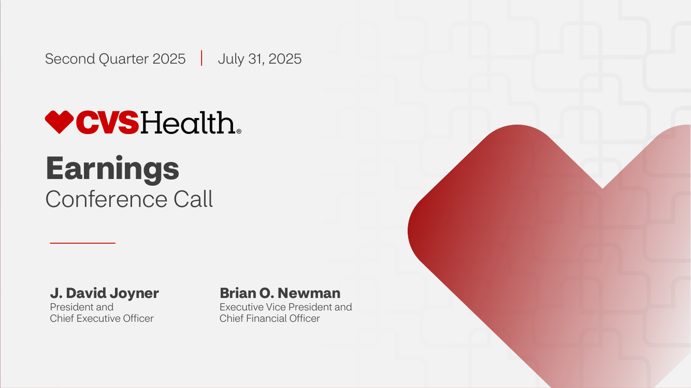

Second Quarter 2025     July 31, 2025

## **Earnings**
##### Conference Call

**J. David Joyner**
President and
Chief Executive Officer

**Brian O. Newman**
Executive Vice President and
Chief Financial Officer

1 ©2025 CVS Health and/or one of its affiliates. Confidential and proprietary.

<!-- source page 2 -->

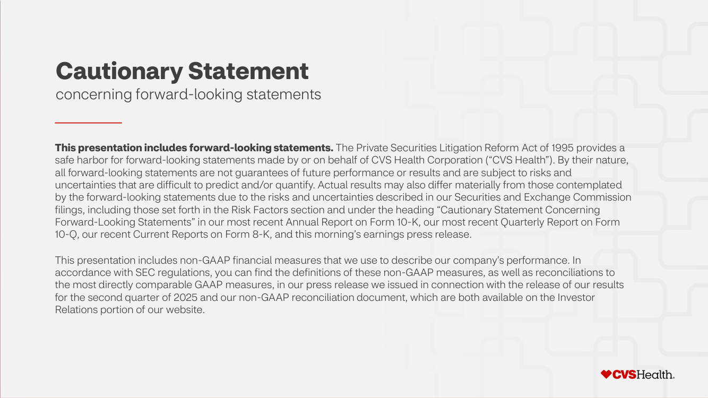
##### **Cautionary Statement**

concerning forward-looking statements

**This presentation includes forward-looking statements.** The Private Securities Litigation Reform Act of 1995 provides a
safe harbor for forward-looking statements made by or on behalf of CVS Health Corporation (“CVS Health”). By their nature,
all forward-looking statements are not guarantees of future performance or results and are subject to risks and
uncertainties that are difficult to predict and/or quantify. Actual results may also differ materially from those contemplated
by the forward-looking statements due to the risks and uncertainties described in our Securities and Exchange Commission
filings, including those set forth in the Risk Factors section and under the heading “Cautionary Statement Concerning
Forward-Looking Statements” in our most recent Annual Report on Form 10-K, our most recent Quarterly Report on Form
10-Q, our recent Current Reports on Form 8-K, and this morning’s earnings press release.

This presentation includes non-GAAP financial measures that we use to describe our company’s performance. In
accordance with SEC regulations, you can find the definitions of these non-GAAP measures, as well as reconciliations to
the most directly comparable GAAP measures, in our press release we issued in connection with the release of our results
for the second quarter of 2025 and our non-GAAP reconciliation document, which are both available on the Investor
Relations portion of our website.

2 ©2025 CVS Health and/or one of its affiliates. Confidential and proprietary.

<!-- source page 3 -->

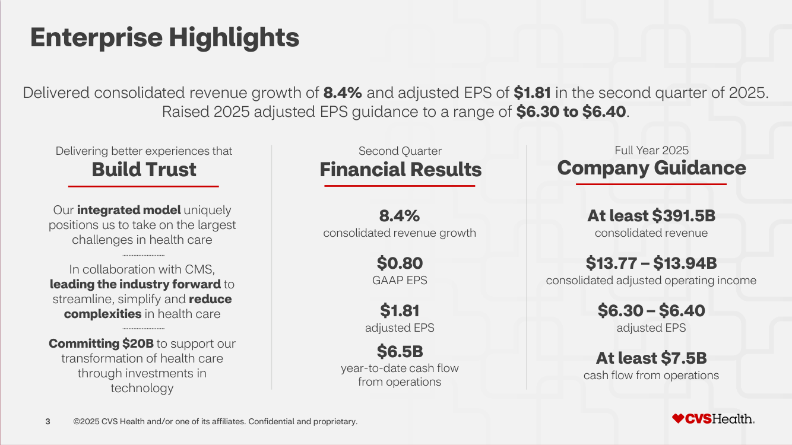
##### **Enterprise Highlights**

Delivered consolidated revenue growth of **8.4%** and adjusted EPS of **$1.81** in the second quarter of 2025.

Raised 2025 adjusted EPS guidance to a range of **$6.30 to $6.40** .

Delivering better experiences that
###### **Build Trust**

Full Year 2025
###### **Company Guidance**

**At least $391.5B**

consolidated revenue

**$13.77 – $13.94B**
consolidated adjusted operating income

**$6.30 – $6.40**

adjusted EPS

**At least $7.5B**
cash flow from operations

Our **integrated model** uniquely
positions us to take on the largest

challenges in health care

In collaboration with CMS,
**leading the industry forward** to

streamline, simplify and **reduce**

**complexities** in health care

**Committing $20B** to support our

Second Quarter
###### **Financial Results**

**8.4%**
consolidated revenue growth

**$0.80**
GAAP EPS

**$1.81**
adjusted EPS

**$6.5B**
year-to-date cash flow

from operations

transformation of health care

through investments in

technology

3 ©2025 CVS Health and/or one of its affiliates. Confidential and proprietary.

<!-- source page 4 -->

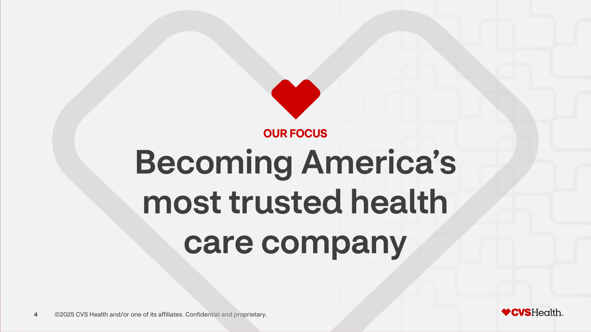

OUR FOCUS

# Becoming America’s

# most trusted health

# care company

4 ©2025 CVS Health and/or one of its affiliates. Confidential and proprietary.

<!-- source page 5 -->

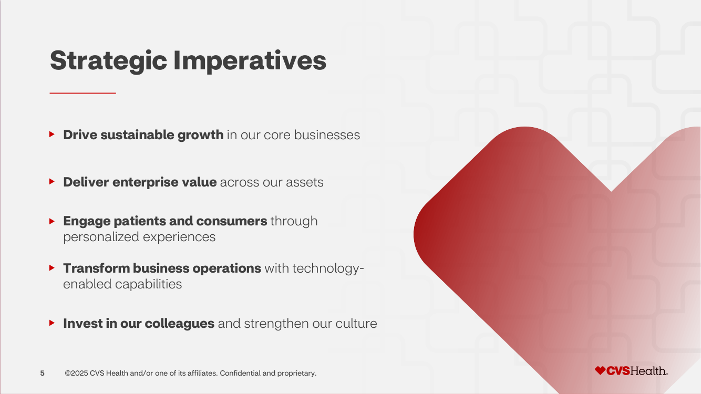
#### **Strategic Imperatives**

**Drive** **sustainable growth** in our core businesses

**Deliver** **enterprise value** across our assets

**Engage patients and consumers** through
personalized experiences

**Transform business operations** with technologyenabled capabilities

**Invest in our colleagues** and strengthen our culture

5 ©2025 CVS Health and/or one of its affiliates. Confidential and proprietary.

<!-- source page 6 -->

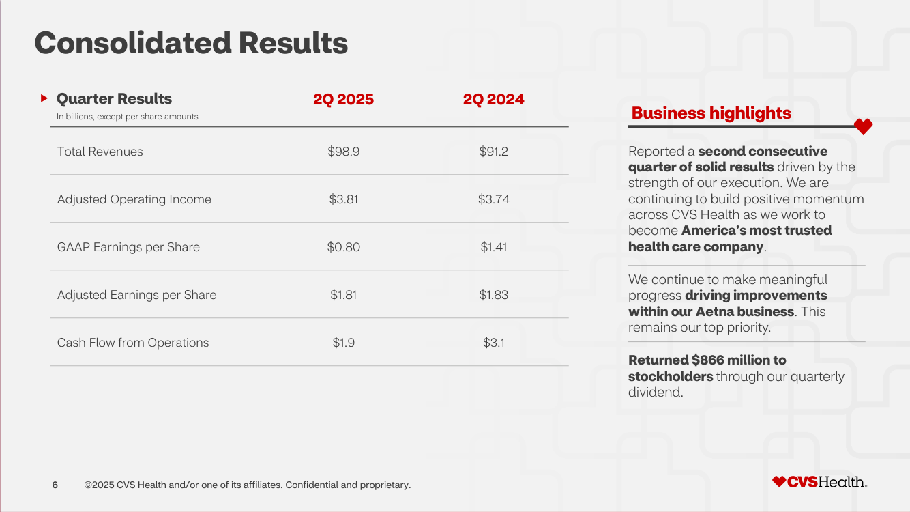
##### **Consolidated Results**

**Quarter Results**
In billions, except per share amounts

**2Q 2025**

**2Q 2024**

Reported a **second consecutive**
**quarter of solid results** driven by the
strength of our execution. We are
continuing to build positive momentum
across CVS Health as we work to
become **America’s most trusted**
**health care company** .

We continue to make meaningful
progress **driving improvements**
**within our Aetna business** . This
remains our top priority.

**Returned $866 million to**
**stockholders** through our quarterly
dividend.

Total Revenues $98.9 $91.2

Adjusted Operating Income $3.81 $3.74

GAAP Earnings per Share $0.80 $1.41

Adjusted Earnings per Share $1.81 $1.83

Cash Flow from Operations $1.9 $3.1

6 ©2025 CVS Health and/or one of its affiliates. Confidential and proprietary.

<!-- source page 7 -->

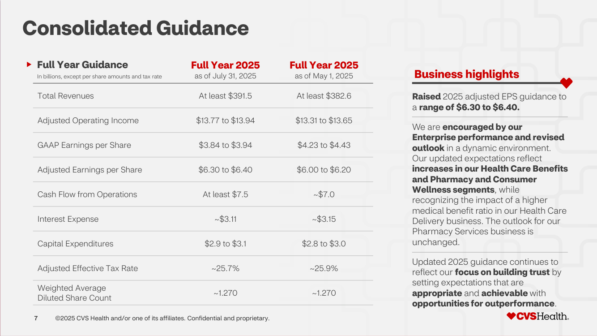
##### **Consolidated Guidance**

**Full Year Guidance**
In billions, except per share amounts and tax rate

**Full Year 2025**

as of July 31, 2025

**Full Year 2025**

as of May 1, 2025

**Raised** 2025 adjusted EPS guidance to
a **range of $6.30 to $6.40.**

We are **encouraged by our**
**Enterprise performance and revised**
**outlook** in a dynamic environment.
Our updated expectations reflect
**increases in our Health Care Benefits**
**and Pharmacy and Consumer**
**Wellness segments**, while
recognizing the impact of a higher
medical benefit ratio in our Health Care
Delivery business. The outlook for our
Pharmacy Services business is
unchanged.

Updated 2025 guidance continues to
reflect our **focus on building trust** by
setting expectations that are
**appropriate** and **achievable** with
**opportunities for outperformance** .

Total Revenues At least $391.5 At least $382.6

Adjusted Operating Income $13.77 to $13.94 $13.31 to $13.65

GAAP Earnings per Share $3.84 to $3.94 $4.23 to $4.43

Adjusted Earnings per Share $6.30 to $6.40 $6.00 to $6.20

Cash Flow from Operations At least $7.5 ~$7.0

Interest Expense ~$3.11 ~$3.15

Capital Expenditures $2.9 to $3.1 $2.8 to $3.0

Adjusted Effective Tax Rate ~25.7% ~25.9%

Weighted Average
~1.270 ~1.270
Diluted Share Count

7 ©2025 CVS Health and/or one of its affiliates. Confidential and proprietary.

<!-- source page 8 -->

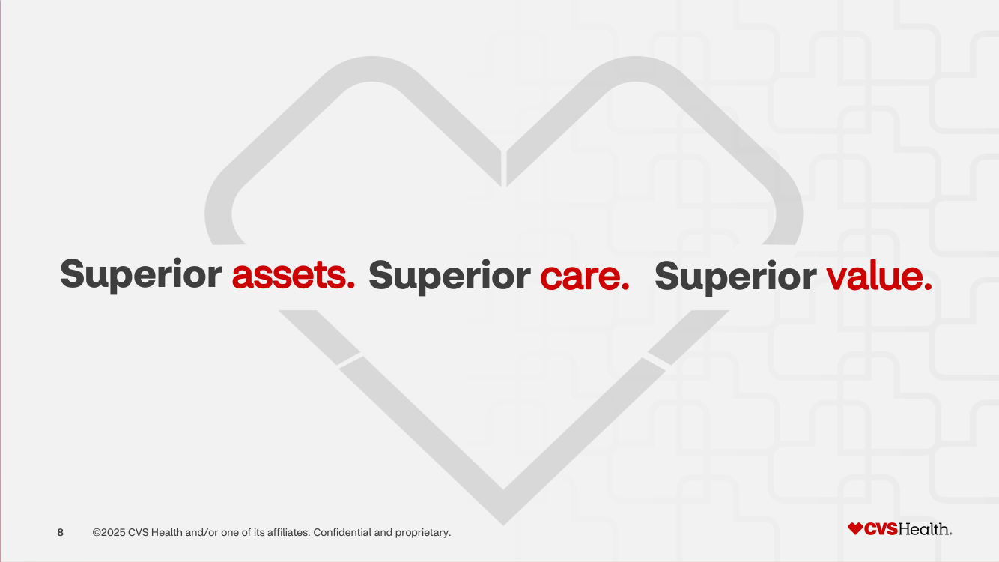

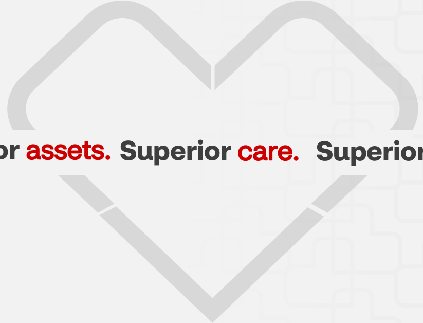

<!-- source page 9 -->

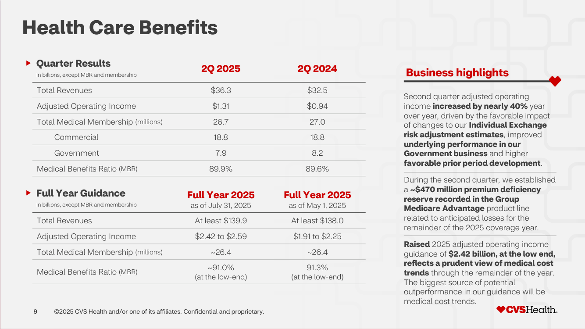
##### **Health Care Benefits**

**Quarter Results**
In billions, except MBR and membership

**2Q 2025** **2Q 2024**

Total Revenues $36.3 $32.5

Adjusted Operating Income $1.31 $0.94

Total Medical Membership (millions) 26.7 27.0

Commercial 18.8 18.8

Government 7.9 8.2

Medical Benefits Ratio (MBR) 89.9% 89.6%

**Full Year Guidance**
In billions, except MBR and membership

**Full Year 2025**

as of July 31, 2025

**Full Year 2025**

as of May 1, 2025

Second quarter adjusted operating
income **increased by nearly 40%** year
over year, driven by the favorable impact
of changes to our **Individual Exchange**
**risk adjustment estimates**, improved
**underlying performance in our**
**Government business** and higher
**favorable prior period development** .

During the second quarter, we established
a **~$470 million premium deficiency**
**reserve recorded in the Group**
**Medicare Advantage** product line
related to anticipated losses for the
remainder of the 2025 coverage year.

**Raised** 2025 adjusted operating income
guidance of **$2.42** **billion, at the low end,**
**reflects a prudent view of medical cost**
**trends** through the remainder of the year.
The biggest source of potential
outperformance in our guidance will be
medical cost trends.

Total Revenues At least $139.9 At least $138.0

Adjusted Operating Income $2.42 to $2.59 $1.91 to $2.25

Total Medical Membership (millions) ~26.4 ~26.4

~91.0%
Medical Benefits Ratio (MBR)
(at the low-end)

9 ©2025 CVS Health and/or one of its affiliates. Confidential and proprietary.

91.3%
(at the low-end)

<!-- source page 10 -->

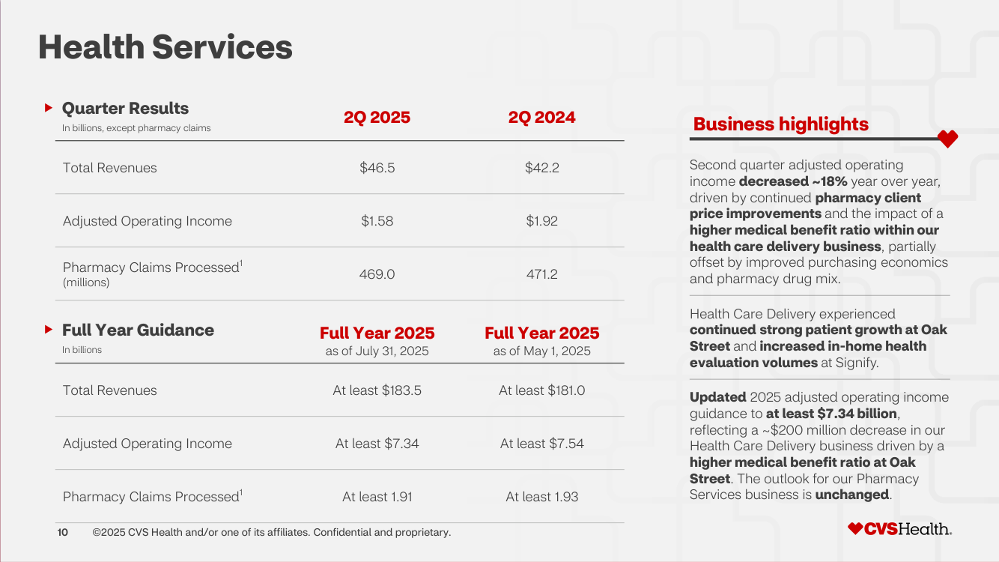
##### **Health Services**

**Quarter Results**
In billions, except pharmacy claims

**2Q 2025** **2Q 2024**

Total Revenues $46.5 $42.2

Adjusted Operating Income $1.58 $1.92

Pharmacy Claims Processed [1]
469.0 471.2
(millions)

**Full Year Guidance**
In billions

**Full Year 2025**

as of July 31, 2025

**Full Year 2025**

as of May 1, 2025

Second quarter adjusted operating
income **decreased ~18%** year over year,
driven by continued **pharmacy client**
**price improvements** and the impact of a
**higher medical benefit ratio within our**
**health care delivery business**, partially
offset by improved purchasing economics
and pharmacy drug mix.

Health Care Delivery experienced
**continued** **strong patient growth at Oak**
**Street** and **increased in-home health**
**evaluation volumes** at Signify.

**Updated** 2025 adjusted operating income
guidance to **at least $7.34 billion**,
reflecting a ~$200 million decrease in our
Health Care Delivery business driven by a
**higher medical benefit ratio at Oak**
**Street** . The outlook for our Pharmacy
Services business is **unchanged** .

Total Revenues At least $183.5 At least $181.0

Adjusted Operating Income At least $7.34 At least $7.54

Pharmacy Claims Processed [1] At least 1.91 At least 1.93

10 ©2025 CVS Health and/or one of its affiliates. Confidential and proprietary.

<!-- source page 11 -->

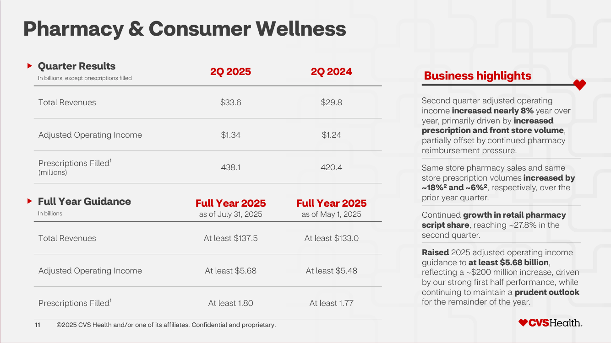
##### **Pharmacy & Consumer Wellness**

**Quarter Results**
In billions, except prescriptions filled

**2Q 2025** **2Q 2024**

Total Revenues $33.6 $29.8

Adjusted Operating Income $1.34 $1.24

Prescriptions Filled [1]
438.1 420.4
(millions)

**Full Year Guidance**
In billions

**Full Year 2025**

as of July 31, 2025

**Full Year 2025**

as of May 1, 2025

Second quarter adjusted operating
income **increased nearly 8%** year over
year, primarily driven by **increased**
**prescription and front store volume**,
partially offset by continued pharmacy
reimbursement pressure.

Same store pharmacy sales and same
store prescription volumes **increased by**
**~18%** **[2]** **and ~6%** **[2]**, respectively, over the
prior year quarter.

Continued **growth in retail pharmacy**
**script share**, reaching ~27.8% in the
second quarter.

**Raised** 2025 adjusted operating income
guidance to **at least $5.68 billion**,
reflecting a ~$200 million increase, driven
by our strong first half performance, while
continuing to maintain a **prudent outlook**
for the remainder of the year.

Total Revenues At least $137.5 At least $133.0

Adjusted Operating Income At least $5.68 At least $5.48

Prescriptions Filled [1] At least 1.80 At least 1.77

11 ©2025 CVS Health and/or one of its affiliates. Confidential and proprietary.

<!-- source page 12 -->

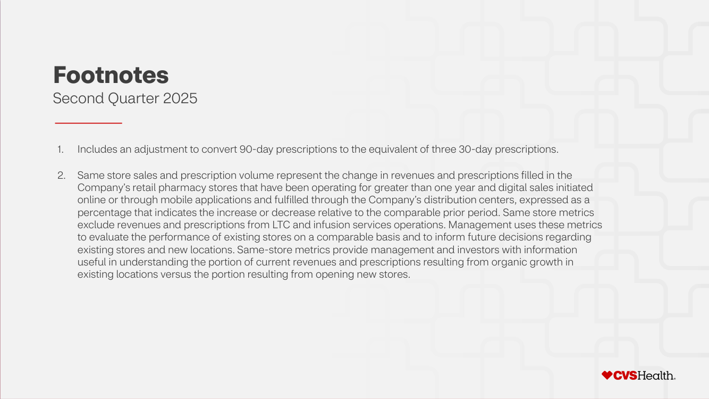
##### **Footnotes**

Second Quarter 2025

1. Includes an adjustment to convert 90-day prescriptions to the equivalent of three 30-day prescriptions.

2. Same store sales and prescription volume represent the change in revenues and prescriptions filled in the
Company’s retail pharmacy stores that have been operating for greater than one year and digital sales initiated
online or through mobile applications and fulfilled through the Company’s distribution centers, expressed as a
percentage that indicates the increase or decrease relative to the comparable prior period. Same store metrics
exclude revenues and prescriptions from LTC and infusion services operations. Management uses these metrics
to evaluate the performance of existing stores on a comparable basis and to inform future decisions regarding
existing stores and new locations. Same-store metrics provide management and investors with information
useful in understanding the portion of current revenues and prescriptions resulting from organic growth in
existing locations versus the portion resulting from opening new stores.

12 ©2025 CVS Health and/or one of its affiliates. Confidential and proprietary.
