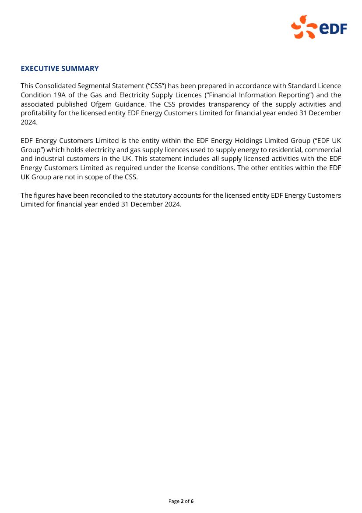
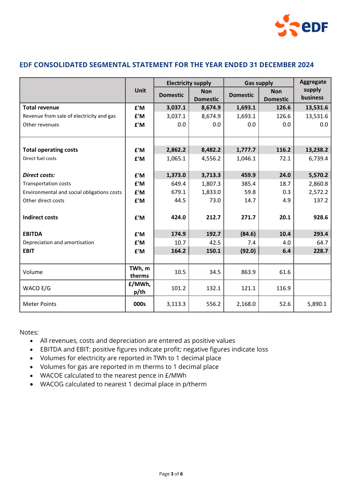
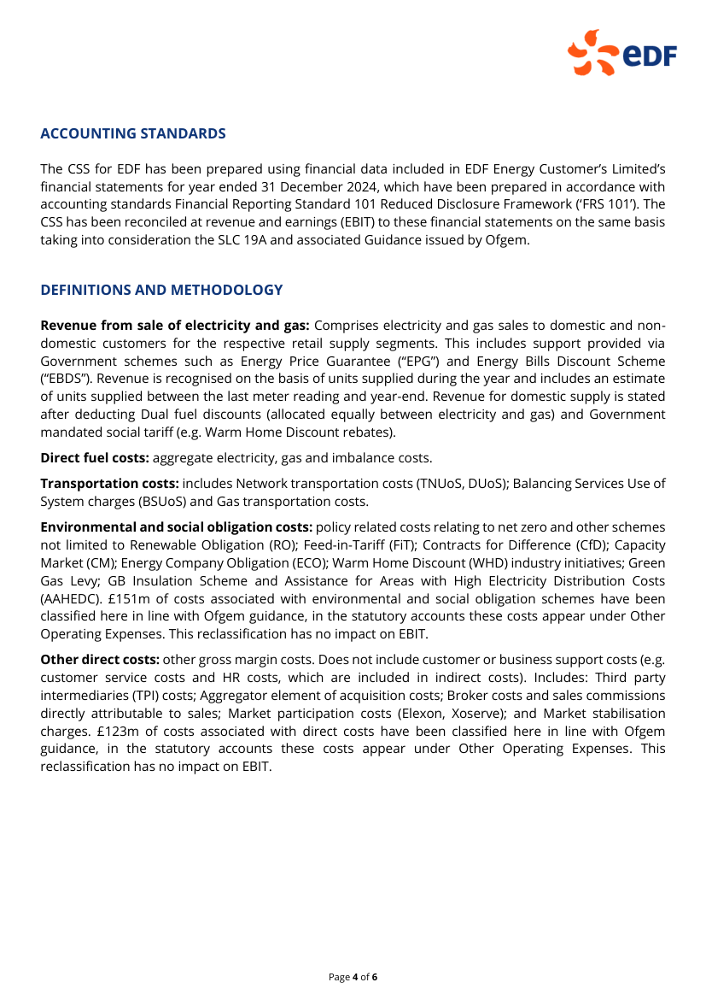
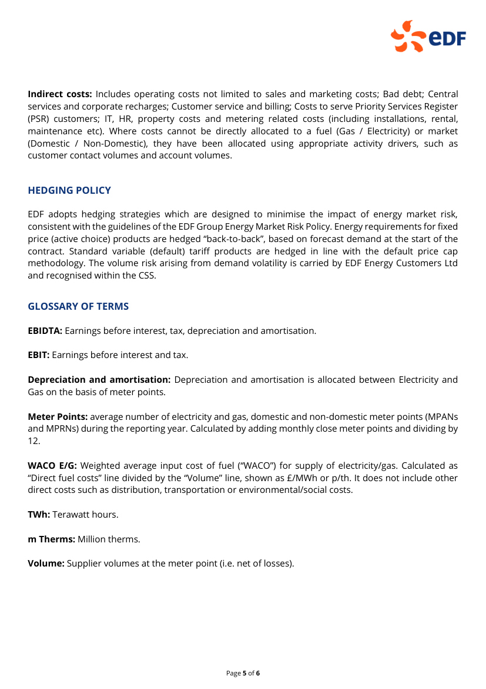
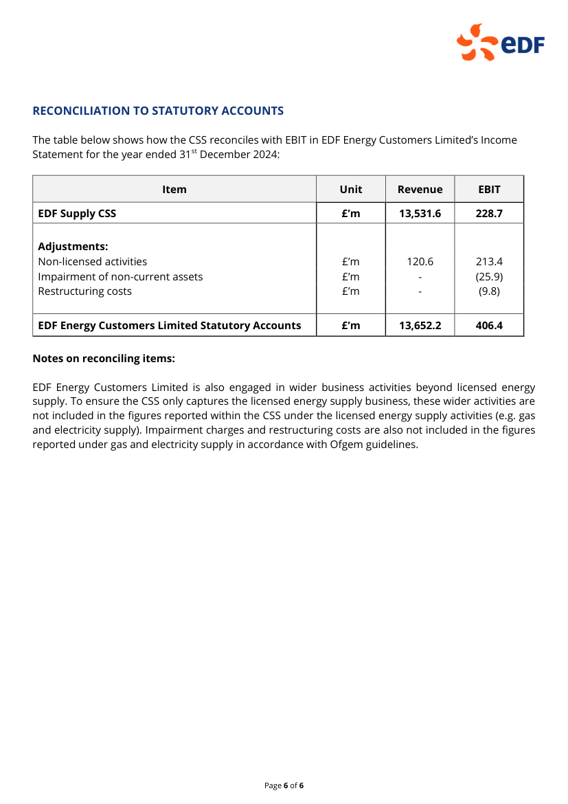

<!-- source page 1 -->

# **EDF Consolidated** **Segmental Statement**

## **for the year ended 31 December 2024**

Page **1** of **6**

<!-- source page 2 -->

**EXECUTIVE SUMMARY**

This Consolidated Segmental Statement (“CSS”) has been prepared in accordance with Standard Licence
Condition 19A of the Gas and Electricity Supply Licences (“Financial Information Reporting”) and the
associated published Ofgem Guidance. The CSS provides transparency of the supply activities and
profitability for the licensed entity EDF Energy Customers Limited for financial year ended 31 December
2024.

EDF Energy Customers Limited is the entity within the EDF Energy Holdings Limited Group (“EDF UK
Group”) which holds electricity and gas supply licences used to supply energy to residential, commercial
and industrial customers in the UK. This statement includes all supply licensed activities with the EDF
Energy Customers Limited as required under the license conditions. The other entities within the EDF
UK Group are not in scope of the CSS.

The figures have been reconciled to the statutory accounts for the licensed entity EDF Energy Customers
Limited for financial year ended 31 December 2024.

Page **2** of **6**

<!-- source page 3 -->

**CONSOLIDATED SEGMENTAL STATEMENT FOR THE YEAR ENDED 31 DECEMBER 2024**

<table>
<thead>
<tr>
<th>Col1</th>
<th>Unit</th>
<th>Electricity supply</th>
<th>Col4</th>
<th>Gas supply</th>
<th>Col6</th>
<th>Aggregate supply business</th>
</tr>
</thead>
<tbody>
<tr>
<td></td>
<td>** Unit**</td>
<td><strong>Domestic</strong></td>
<td><strong>Non</strong> <strong>Domestic</strong></td>
<td><strong>Domestic</strong></td>
<td><strong>Non</strong> <strong>Domestic</strong></td>
<td><strong>Non</strong> <strong>Domestic</strong></td>
</tr>
<tr>
<td><strong>Total revenue</strong> Revenue from sale of electricity and gas Other revenues </td>
<td><strong>£'M</strong> <strong>£'M</strong> <strong>£'M</strong></td>
<td><strong>3,037.1</strong> 3,037.1 0.0 </td>
<td><strong>8,674.9</strong> 8,674.9 0.0 </td>
<td><strong>1,693.1</strong> 1,693.1 0.0 </td>
<td><strong>126.6</strong> 126.6 0.0 </td>
<td><strong>13,531.6</strong> 13,531.6 0.0 </td>
</tr>
<tr>
<td> <strong>Total operating costs</strong> Direct fuel costs   <strong><em>Direct costs:</em></strong> Transportation costs Environmental and social obligations costs Other direct costs   <strong>Indirect costs</strong>   <strong>EBITDA</strong> Depreciation and amortisation  <strong>EBIT</strong> </td>
<td> <strong>£'M</strong> <strong>£'M</strong> <strong>£'M</strong> <strong>£'M</strong> <strong>£'M</strong> <strong>£'M</strong> <strong>£'M</strong> <strong>£'M</strong> <strong>£'M</strong> <strong>£'M</strong></td>
<td> <strong>2,862.2</strong> 1,065.1   <strong>1,373.0</strong> 649.4 679.1 44.5   <strong>424.0</strong>   <strong>174.9</strong> 10.7 <strong>164.2</strong> </td>
<td> <strong>8,482.2</strong> 4,556.2   <strong>3,713.3</strong> 1,807.3 1,833.0 73.0   <strong>212.7</strong>   <strong>192.7</strong> 42.5 <strong>150.1</strong> </td>
<td> <strong>1,777.7</strong> 1,046.1   <strong>459.9</strong> 385.4 59.8 14.7   <strong>271.7</strong>   <strong>(84.6)</strong> 7.4 <strong>(92.0)</strong> </td>
<td> <strong>116.2</strong> 72.1   <strong>24.0</strong> 18.7 0.3 4.9   <strong>20.1</strong>   <strong>10.4</strong> 4.0 <strong>6.4</strong> </td>
<td> <strong>13,238.2</strong> 6,739.4   <strong>5,570.2</strong> 2,860.8 2,572.2 137.2   <strong>928.6</strong>   <strong>293.4</strong> 64.7 <strong>228.7</strong> </td>
</tr>
<tr>
<td>Volume</td>
<td><strong>TWh, m</strong> <strong>therms</strong></td>
<td>10.5</td>
<td>34.5</td>
<td>863.9</td>
<td>61.6</td>
<td></td>
</tr>
<tr>
<td>WACO E/G</td>
<td><strong>£/MWh,</strong> <strong>p/th</strong></td>
<td>101.2</td>
<td>132.1</td>
<td>121.1</td>
<td>116.9</td>
<td></td>
</tr>
<tr>
<td>Meter Points</td>
<td><strong>000s</strong></td>
<td>3,113.3</td>
<td>556.2</td>
<td>2,168.0</td>
<td>52.6</td>
<td>5,890.1</td>
</tr>
</tbody>
</table>

Notes:

  - All revenues, costs and depreciation are entered as positive values

  - EBITDA and EBIT: positive figures indicate profit; negative figures indicate loss

  - Volumes for electricity are reported in TWh to 1 decimal place

  - Volumes for gas are reported in m therms to 1 decimal place

  - WACOE calculated to the nearest pence in £/MWh

  - WACOG calculated to nearest 1 decimal place in p/therm

Page **3** of **6**

<!-- source page 4 -->

**ACCOUNTING STANDARDS**

The CSS for EDF has been prepared using financial data included in EDF Energy Customer’s Limited’s
financial statements for year ended 31 December 2024, which have been prepared in accordance with
accounting standards Financial Reporting Standard 101 Reduced Disclosure Framework (‘FRS 101’). The
CSS has been reconciled at revenue and earnings (EBIT) to these financial statements on the same basis
taking into consideration the SLC 19A and associated Guidance issued by Ofgem.

**DEFINITIONS AND METHODOLOGY**

**Revenue from sale of electricity and gas:** Comprises electricity and gas sales to domestic and nondomestic customers for the respective retail supply segments. This includes support provided via
Government schemes such as Energy Price Guarantee (“EPG”) and Energy Bills Discount Scheme
(“EBDS”). Revenue is recognised on the basis of units supplied during the year and includes an estimate
of units supplied between the last meter reading and year-end. Revenue for domestic supply is stated
after deducting Dual fuel discounts (allocated equally between electricity and gas) and Government
mandated social tariff (e.g. Warm Home Discount rebates).

**Direct fuel costs:** aggregate electricity, gas and imbalance costs.

**Transportation costs:** includes Network transportation costs (TNUoS, DUoS); Balancing Services Use of
System charges (BSUoS) and Gas transportation costs.

**Environmental and social obligation costs:** policy related costs relating to net zero and other schemes
not limited to Renewable Obligation (RO); Feed-in-Tariff (FiT); Contracts for Difference (CfD); Capacity
Market (CM); Energy Company Obligation (ECO); Warm Home Discount (WHD) industry initiatives; Green
Gas Levy; GB Insulation Scheme and Assistance for Areas with High Electricity Distribution Costs
(AAHEDC). £151m of costs associated with environmental and social obligation schemes have been
classified here in line with Ofgem guidance, in the statutory accounts these costs appear under Other
Operating Expenses. This reclassification has no impact on EBIT.

**Other direct costs:** other gross margin costs. Does not include customer or business support costs (e.g.
customer service costs and HR costs, which are included in indirect costs). Includes: Third party
intermediaries (TPI) costs; Aggregator element of acquisition costs; Broker costs and sales commissions
directly attributable to sales; Market participation costs (Elexon, Xoserve); and Market stabilisation
charges. £123m of costs associated with direct costs have been classified here in line with Ofgem
guidance, in the statutory accounts these costs appear under Other Operating Expenses. This
reclassification has no impact on EBIT.

Page **4** of **6**

<!-- source page 5 -->

**Indirect costs:** Includes operating costs not limited to sales and marketing costs; Bad debt; Central
services and corporate recharges; Customer service and billing; Costs to serve Priority Services Register
(PSR) customers; IT, HR, property costs and metering related costs (including installations, rental,
maintenance etc). Where costs cannot be directly allocated to a fuel (Gas / Electricity) or market
(Domestic / Non-Domestic), they have been allocated using appropriate activity drivers, such as
customer contact volumes and account volumes.

**HEDGING POLICY**

EDF adopts hedging strategies which are designed to minimise the impact of energy market risk,
consistent with the guidelines of the EDF Group Energy Market Risk Policy. Energy requirements for fixed
price (active choice) products are hedged “back - to - back”, based on forecast demand at the start of the
contract. Standard variable (default) tariff products are hedged in line with the default price cap
methodology. The volume risk arising from demand volatility is carried by EDF Energy Customers Ltd
and recognised within the CSS.

**GLOSSARY OF TERMS**

**EBIDTA:** Earnings before interest, tax, depreciation and amortisation.

**EBIT:** Earnings before interest and tax.

**Depreciation and amortisation:** Depreciation and amortisation is allocated between Electricity and
Gas on the basis of meter points.

**Meter Points:** average number of electricity and gas, domestic and non-domestic meter points (MPANs
and MPRNs) during the reporting year. Calculated by adding monthly close meter points and dividing by
12.

**WACO E/G:** Weighted average input cost of fuel (“WACO”) for supply of electricity/gas. Calculated as
“Direct fuel costs” line divided by the “Volume” line, shown as £/MWh or p/th. It does not include other
direct costs such as distribution, transportation or environmental/social costs.

**TWh:** Terawatt hours.

**m Therms:** Million therms.

**Volume:** Supplier volumes at the meter point (i.e. net of losses).

Page **5** of **6**

<!-- source page 6 -->

**RECONCILIATION TO STATUTORY ACCOUNTS**

The table below shows how the CSS reconciles with EBIT in EDF Energy Customers Limited’s Income
Statement for the year ended 31 [st] December 2024:

<table>
<thead>
<tr>
<th>Item</th>
<th>Unit</th>
<th>Revenue</th>
<th>EBIT</th>
</tr>
</thead>
<tbody>
<tr>
<td><strong>EDF Supply CSS</strong></td>
<td><strong>£’m</strong> </td>
<td><strong>13,531.6</strong></td>
<td><strong>228.7</strong></td>
</tr>
<tr>
<td> <strong>Adjustments:</strong> Non-licensed activities Impairment of non-current assets Restructuring costs </td>
<td>   £’m £’m £’m </td>
<td>   120.6 -  -  </td>
<td>   213.4 (25.9) (9.8) </td>
</tr>
<tr>
<td><strong>EDF Energy Customers Limited Statutory Accounts</strong></td>
<td><strong>£’m</strong></td>
<td><strong>13,652.2</strong></td>
<td><strong>406.4</strong></td>
</tr>
</tbody>
</table>

**Notes on reconciling items:**

EDF Energy Customers Limited is also engaged in wider business activities beyond licensed energy
supply. To ensure the CSS only captures the licensed energy supply business, these wider activities are
not included in the figures reported within the CSS under the licensed energy supply activities (e.g. gas
and electricity supply). Impairment charges and restructuring costs are also not included in the figures
reported under gas and electricity supply in accordance with Ofgem guidelines.

Page **6** of **6**
