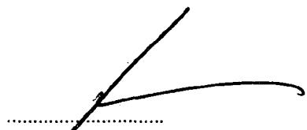

<!-- source page 1 -->

# HIPPODROME CASINO LIMITED

# REPORT AND FINANCIAL STATEMENTS

# FOR THE YEAR ENDED

# 31 DECEMBER 2025

TUESDAY

A03

16/06/2026

#112

COMPANIES HOUSE

Company registration number 05497987 (England and Wales)

<!-- source page 2 -->

# HIPPODROME CASINO LIMITED

# COMPANY INFORMATION

# Directors

Mr J S Thomas

Mr M King

Mr J C Barnsley

Mr J R Delf

Mr T Bowry-Blum

Mr P I Lewis

Mr R A Bangs

# Company number

05497987

# Registered office

Hippodrome Casino

Cranbourn Street

London

WC2H 7JH

# Auditor

RSM UK Audit LLP

Chartered Accountants

Third Floor

Priory Place

New London Road

Chelmsford

CM2 0PP

<!-- source page 3 -->

The directors present the strategic report for the year ended 31 December 2025.

# Fair review of the business and future developments

The business delivered a strong performance in the year ended 31 December 2025, against a backdrop of continued inflationary cost pressures and subdued consumer sentiment.

Turnover increased by 2% to £116.8m (2024: £114.6m), supported by Government White Paper reforms allowing sports betting and the expansion of our Slots portfolio from 20 to 80 machines. Hospitality revenues also improved, with the launch of Paddy's Sportsbook proving an early success.

Gross profit grew by 4% to £67.2m (2024: £64.9m), reflecting effective management of cost of sales. Across the sector, inflationary pressures continued to impact operating costs during the year, including payroll following the hike in national insurance contributions, cleaning and security costs.

EBITDA for the year was £10.8m (2024: £13.3m), still a good performance given the challenging macroeconomic environment.

The Company continues to secure its position at the heart of West end entertainment. We are acknowledged as a 'founding member' of the newly defined 'fun economy,' bringing together tourism, theatre, concerts, gambling, and entertainment which, it is estimated, now accounts for 15% of national turnover. Our performance continues to be recognised at both European and global level. We have secured Best Overall Casino at the European Casino Awards and Casino of the Year at the Global Gaming Awards. Heliot Steak House has retained Best Casino Restaurant, while Archive & Myth remains within the UK's top 50 cocktail bars.

We expect the business to continue to perform well in 2026, despite the continued uncertain economic environment. Our strategy remains unchanged, developing the business for the benefit of our customers, expanding our range of world leading offers to provide an experience that cannot be matched anywhere. Our Gods deck is being transformed into a Live Studio and scheduled to open in June 2026. We maintain planning permission to extend our roof terrace to include additional gaming and a hospitality space with up to 200 covers with the timing of this development under review.

# About The Hippodrome Casino

A timeline of becoming the 'best casino in the world':

<table><tr><td>2006</td><td>- Current principal shareholder and Executive Chairman, Simon Thomas and his late father Jimmy Thomas ‘discovered’ The Hippodrome. Down on its luck but considered a perfect venue for a new breed of British casino.</td></tr><tr><td>2010 – 2012</td><td>- Having successfully secured the necessary licences and permissions an extensive two year build and renovation project and a capital investment of over £50m sees the vacant and derelict building restored.</td></tr><tr><td>2012</td><td>- The Hippodrome was officially opened for business by Boris Johnson, then Mayor of London.- Soul diva Dionne Warwick headlines at our (then) cabaret theatre.- Pokerstars becomes partner in our poker deck.</td></tr><tr><td>2013</td><td>- The late, great Sir Bruce Forsyth and Dame Barbara Windsor celebrate together at a reunion of the singers, dancers and backstage team at a reunion of the world-famous Talk of the Town.- The Bishop of Liverpool, the Rt Rev James Jones KBE, discusses casino banking for BBC Radio 4 on the main floor of the Hippodrome in full episcopal vestments.- A historic return to the Hippodrome by Joe Longthorne who performed here on the closing night of the legendary Talk of the Town in 1982.</td></tr></table>

HIPPODROME CASINO LIMITED

STRATEGIC REPORT

FOR THE YEAR ENDED 31 DECEMBER 2025

-1-

<!-- source page 4 -->

# HIPPODROME CASINO LIMITED

# STRATEGIC REPORT (CONTINUED)

# FOR THE YEAR ENDED 31 DECEMBER 2025

- 2014 - Pop star ‘Prince’ performs at the Hippodrome in what was, tragically, to be his final ever London performance.
- - Tennis legend Rafael Nadal played a charity poker match against Brazilian footballer Ronaldo raising \$50,000 for The Rafa Nadal Foundation. As a forfeit for losing, the former Real Madrid star is forced to don a pair of marigolds and do the washing up in the Hippodrome's kitchen.
- 2015 - Purchased the Crystal Rooms Adult Gaming Centre, located on the building's frontage on Cranbourn Street, but owned separately. This allowed the integration of the space into the main Hippodrome venue.
- 2016 - Comedy legend Micky Flanagan performs his raft of trial material in a series of 20 sell-out shows called 'Work In Progress'.
- 2017 - Michael Ball's fans are the most loyal we've experienced. Queues outside the then-cabaret theatre form six hours ahead of his performance.
- - The Daily Telegraph reports: "Since the Brexit vote last summer, Simon Thomas's numbers keep coming up. At the roulette wheels and blackjack tables of his Hippodrome Casino in Leicester Square, London, dollar and euro income has increased by 20pc."
- - Organised by the European Casino Association (ECA) we host the 2017 European Dealer Championship, the first time in London in the competition's history. Thirty-one judges from 20 countries oversee the event.
- 2018 - On the live final of ITV's Britain's Got Talent, Channing Tatum announces the Hippodrome will host Magic Mike Live. His announcement 'breaks' TicketMaster, puts Twitter into meltdown and trends No. 9 globally. The show opens in November the same year.
- 2020 - During lockdown, we took the opportunity to add an extra floor to our terrace to create an iconic rooftop bar.
- 2021 - Simon Thomas declares the Hippodrome open post-Covid on May 17, with a pledge never to shut the doors again. Customers entering at midnight are the first to experience the new three tier outdoor terrace, built during the lockdown.
- - We launch our expanded poker facilities covering an entire third floor with 17 tables, London's largest and by far (still) its most popular.
- - Hailed as the "best party of the year" we host British grime MC, rapper, record producer and DJ Skepta's launch for his latest EP 'All In'.
- 2022 - We publish a book, 'The Hippodrome: An Entertainment of Unexampled Brilliance', by renowned author Luci Gosling, which critics agree is a definitive history of the building and the hundreds of performers who have entertained London here since opening in 1900.
- - Chop Chop by Four Seasons opens on our lower ground floor to wide acclaim. Reviewer Jay Rayner for the Guardian was an unequivocal fan: "For great Chinese food at any time in central London, Chop Chop is an absolute winner". Chop Chop currently sits securely within the top 20 best London restaurants on Trip Advisor, out of more than 15,000.
- 2023 - We welcome back Dame Shirley Bassey for a birthday dinner. She performed here in its glory days of Talk of the Town. Press headlines follow with speculation that one day she may perform here one more time. If only...
- - Max Halley and his 'Max's Sandwich Shop', joins forces with the Hippodrome and adds his legendary sandwiches to our 24-hour menu.
- 2024 - The Heliot Steakhouse is remodelled to include an elegant and expanded mid-tier restaurant deck.
- - Archive and Myth, our new cocktail bar, launches and lands within the top 50 cocktail bars in the UK in its first year of operations.
- - We threw a party for our Stakeholders to mark the 12-year anniversary of our opening.

-2-

<!-- source page 5 -->

# HIPPODROME CASINO LIMITED

# STRATEGIC REPORT (CONTINUED)

# FOR THE YEAR ENDED 31 DECEMBER 2025

# 2025

- - Slot machine capacity increased from 20 to 80 following the Government's White Paper, enabling the launch of a dedicated Slots Lounge and strengthening the core gaming offer.
- - Paddy's Sportsbook launched in partnership with Paddy Power, introducing a new sports-led experience within the venue.

# Our Business

The Hippodrome sits on the corner of Leicester Square, in the heart of London's world-renowned West End.

The building, one of the city's most famous theatrical icons, has hosted many of the last century's groundbreaking diversions, shows and entertainments. Since opening in 1900 it has pushed boundaries, presented the bold, the new, the never-seen-before.

Today one in eight casino visits in the country are to the Hippodrome. In London, that rises to one in every three.

Since opening in 2012, our 700+ staff have welcomed over 20 million visitors from 157 different countries. And if that is not enough, we've won fame and a cabinet full of awards.

As the first casino in the UK to embrace the 'Las Vegas-style' of world class entertainment, food and drink alongside our gambling we have:

- - Three uniquely themed gaming floors full of exciting live tables, electronic terminal and slot machines
- - Two multi-award winning restaurants: Heliot Steak House and Chop Chop
- - Nine bars
- • London's largest Poker room
- - Theatrical juggernaut Magic Mike Live – now in its eighth year and continuing to deliver strong demand
- - Central London's largest three-tier outdoor terrace with magnificent views over Soho
- - London's first fully integrated Sportsbook & Casino

With around 1.6 million guests annually, a visit to the Hippodrome is now classed as a 'must do' tourist experience that sits alongside a trip to the Tower of London or Fortnum's amongst the many other iconic tourist attractions.

# The Hippodrome in NUMB3RS

Staff: 703

Visitors annually: 1.6 million

Visitors since opening: 20 million

Steaks served annually: 37,000

Pints served annually: 270,000

Cocktails served annually: 275,000

Share of the British casino market: 12%

Magic Mike audience members so far: 900,000+

Total in machine jackpots won since opening: £12+ million

Magic Mike performances so far: 3000+

Bottles of wine served each year: 40,000

Electronic roulette games played: 187 million

Roulette games played: 127 million

Slots games played: 993 million

Three card poker games played: 37 million

Blackjack games played: 90 million

Dim Sum served in Chop Chop each year: 18,000

Decks of cards used each week: 465

# Our Stakeholders

The directors consider the following groups to be our key Stakeholders. The Board seeks to understand the interests of the Stakeholder groups so that they may be properly considered in the decision-making process. This is done through direct engagement, receiving reports from management and inclusion of stakeholder interests in Board papers as appropriate.

# Our Staff

Fundamental to the delivery of our vision and strategy are our staff who expect a workplace that is safe, inclusive and offers them opportunity to develop, learn and engage. We are committed to equal opportunities and employment where everyone is treated with fairness, dignity and respect. We strive to be a responsible employer and this is reflected in our approach to pay, benefits and the health & safety and wellbeing of our staff. We recognise the ongoing issues around the cost-of-living crisis and are actively reviewing the market to ensure that our pay rates remain competitive. Our staff want to be part of the decisions that affect them, being empowered to make decisions, be safe to challenge management, be curious to ask questions and be supported by effective systems of communication.

-3-

<!-- source page 6 -->

# HIPPODROME CASINO LIMITED

# STRATEGIC REPORT (CONTINUED)

# FOR THE YEAR ENDED 31 DECEMBER 2025

The Company continues to invest in employee engagement and training and we are constantly seeking ways we can improve and better engage with our employees.

We have an active forum on the staff app where employees are encouraged to feedback ideas and views. Senior managers actively participate on the forum and engage with employees across the business.

Staff engagement and well-being is paramount to the success of the Hippodrome, ensuring the business has the culture and values critical to the delivery of our strategy.

The board receive regular reports from the HR department on all aspects relating to the value development and well-being of our staff.

# Our Partners and Suppliers

The Hippodrome can only offer and deliver the world class products and services with the support of our Partners and Suppliers. The business is built on our brand strength and ensuring our values are aligned with our suppliers, ensures that together we continue to create valuable strategic partnerships along with the safety, security and resilience of our operations. These partnerships have given us the ability to grow and expand the Hippodrome over the last 14 years. Technology and innovation has been key to our success and working in partnership with our suppliers we continually improve and remain at the cutting edge in the industry, with the best and most exciting gaming products and hospitality for our customers.

We also outsource a number of key activities across the Hippodrome and undertake appropriate due diligence and have regular engagement with all our providers. Our approach to procurement ensures we treat partners and suppliers fairly which includes ensuring prompt payment where we pay 84% of our invoices within the agreed terms and work actively and constructively to resolve any issues if they arise.

We have nurtured a long-standing relationship with our principal finance provider, since inception of the business. There is an emphasis on openness and integrity in all our dealings. We maintain regular dialogue with our lender to ensure we secure the most appropriate and attractive funding.

# Our Customers

Our customers are at the heart of everything we do at the Hippodrome and it is vital to our long term strategy for success that we provide everything they need to maximise their enjoyment and entertainment when they visit us. Management work closely with regular customers to ensure we fully understand their needs and how we can improve their experience and enjoyment with a world-class casino and entertainment venue. In doing so, we aim to provide a fun and accessible environment and deliver a best in class customer experience.

# Our Shareholders

As a privately owned company, our shareholders support our strategic objectives and seek a sustainable long-term return on their investment. The Company maintains a very close relationship with all its shareholders and regularly keeps them fully informed on performance of the business, relevant developments and our strategy.

# People and Communities

We remain passionate, fully committed and very active in supporting our people and the communities surrounding the casino and beyond, to ensure a vibrant and sustainable environment for all. This continued investment in our people and our communities supports our Social Responsibility objectives. These efforts will be supported by our charitable trust, which was established in 2023. In addition, the Hippodrome contributes to a range of charities and community projects both in terms of financial commitments, or use of our facilities. In particular, we have supported the University of Liverpool with financial donations to further research into gambling related harm.

# Maximising Value and Efficiency

Increasing value and efficiency by maximising income, lowering operating costs and driving capital efficiency is a key pillar of our business strategy.

-4-

<!-- source page 7 -->

# HIPPODROME CASINO LIMITED

# STRATEGIC REPORT (CONTINUED)

# FOR THE YEAR ENDED 31 DECEMBER 2025

# Our income – how do we earn our revenue?

Our income comes from the facilities we operate and services we offer at the Hippodrome.

<table><tr><td>Gaming income</td><td>Live Table, Electronic &amp; Poker</td><td>Customers choose to gamble via one of the many live tables and different games that we offer, or the many gaming and slot machines located across the Hippodrome.</td></tr><tr><td>Hospitality income</td><td>Food &amp; Beverage</td><td>Customers eat and drink in one of our many bars and restaurants.</td></tr><tr><td></td><td>Cabaret / Other</td><td>Customers buy tickets to attend the Magic Mike Live show.</td></tr></table>

# Our Costs - What Are Our Outgoings?

We incur significant costs in providing all the services and facilities across the Hippodrome:

<table><tr><td rowspan="5">Operating costs</td><td>Staff costs</td><td>To keep the Hippodrome running 24/7 we employ a large workforce.</td></tr><tr><td>Maintenance &amp; equipment costs</td><td>We&#x27;re open 24 hours a day, with over one and a half million customers coming through our doors annually. We&#x27;re consistently cleaning, repairing, renewing and updating our building and equipment.</td></tr><tr><td>Rent and rates</td><td>We pay rent to our landlord, one of our most important Stakeholders, as well as rates and taxes in relation to the property.</td></tr><tr><td>Utilities</td><td>Every part of our operation requires power. We continue to work hard to save energy and be as sustainable as we can.</td></tr><tr><td>Other costs</td><td>The significant range of our product and service offerings at the Hippodrome results in a wide variety of costs. For example, security to keep the Hippodrome safe at all times.</td></tr></table>

# Regulation at The Hippodrome Casino

The Group is subject to regulation by the Gambling Commission under the Gambling Act 2005. This includes compliance with operating licence conditions, Licence Conditions and Codes of Practice ("LCCP"), and personal licence requirements applicable to relevant employees, senior management and Board members.

Following the publication of the Government's White Paper on gambling reform, a number of regulatory changes have been introduced, with further reforms continuing to be consulted upon and implemented by the Gambling Commission and the Department for Culture, Media and Sport.

Key developments during the year include:

- - Consumer Choice on Direct Marketing – New requirements have been introduced to provide customers with greater control over the gambling marketing communications they receive, including enhanced customer choice regarding marketing preferences.
- - Gambling Commission Licence Fees – Licence fees payable by gambling operators have been revised to support the Gambling Commission's expanded regulatory, supervisory and enforcement activities.
- - Statutory Levy – Legislation has been introduced to establish a statutory levy on gambling operators to fund research, prevention and treatment relating to gambling harms, replacing the previous system of voluntary industry contributions.

-5-

<!-- source page 8 -->

# HIPPODROME CASINO LIMITED

# STRATEGIC REPORT (CONTINUED)

# FOR THE YEAR ENDED 31 DECEMBER 2025

- - Gambling Ombudsman – The Government has committed to the establishment of an independent Gambling Ombudsman to handle disputes between customers and operators and provide redress where appropriate. Implementation remains subject to further legislative and operational development.
- - Gaming Machine Allowances and Land-Based Casino Reforms – The Government has progressed a number of reforms affecting the land-based casino sector, including changes to gaming machine entitlements and measures intended to modernise the regulatory framework. Certain elements remain subject to ongoing implementation and commencement arrangements.
- - Player Protections – The Gambling Commission has introduced, and continues to develop, a range of customer protection measures arising from the White Paper, including financial risk assessments, enhanced consumer information requirements and other safeguards designed to reduce gambling-related harm.
- - Local Authority Premises Licence Fees – The Government has reviewed the fee caps applicable to premises licences issued by local authorities, with implementation of any revised arrangements subject to the relevant legislative and administrative processes.

The Group continues to monitor regulatory developments and implementation guidance issued by the Gambling Commission and other relevant authorities and is working to ensure ongoing compliance with applicable requirements.

# Capital Investment at The Hippodrome Casino

We continue to invest in creating exceptional spaces for our customers to enjoy with the introduction of Paddy's Sportsbook and our new Slots Lounge in 2025. As we look ahead, we expect to maintain our progress and keep investing selectively across the business. Our investment decisions are driven by a combination of key drivers: customer experience and choice, safety and compliance, property stewardship, efficiency and revenue growth.

# Our Core Purpose

The Hippodrome exists to fulfil the needs of our customers by delivering an experience unmatched by any other business around the world. Customers are at the centre of everything we do. We are a casino based entertainment complex that aims to Surprise, Amaze, make Memorable and Entertain. Defined as S.A.M.E this is applied to and integrated with every aspect of the Hippodrome business, every day, to world class standards.

# Our Fundamental Principles

# 1 Freedom

We value individual freedom above all else. No one has the right to tell another how to be or act.

# 2 Equality & Equity

We are all equal and equal in all things, regardless of gender, race, religion, language, family or any other matters.

# 3 Community

We build and participate in communities to enrich lives, provide for the needs of our associates, and keep them safe from harm.

Underpinning our Fundamental Principles is a strengthened focus and investment on simplifying the customer journey through the various elements of the Hippodrome, ensuring an easy and above all enjoyable experience.

# Our Shared Values

Our Shared Values support our strategy. They represent what we believe in and who we aspire to be. It's not just what we achieve, but how we work together, that sets us apart. Guided by our values, we'll make the Hippodrome an even better place to visit and work.

-6-

<!-- source page 9 -->

# HIPPODROME CASINO LIMITED

# STRATEGIC REPORT (CONTINUED)

# FOR THE YEAR ENDED 31 DECEMBER 2025

Our core values are:

- • Service Excellence and Customer Experience
- - Respect
- • Integrity
- • Innovation
- - Accountability
- - Teamwork

# Section 172 (1) Statement

Section 172 of the Companies Act 2006 requires the directors of the Company to act in the way they consider, in good faith, would most likely promote the success of the Company for the benefit of its members. In doing so, section 172 requires a director to have regard (among other matters) to:

- a. The likely consequences of any decisions in the long term
- b. The interests of the Company's employees
- c. The need to foster the Company's business relationships with suppliers, customers and others
- d. The impact of the Company's operations on the community and environment
- e. The desirability of the Company maintaining a reputation for high standards of business conduct
- f. The need to act fairly as between members of the Company

The directors discharge their section 172 duty by having regard to the factors set out above along with other relevant factors. The directors will ensure key decisions are in line with the Hippodrome's Core Purpose, Fundamental Principles and Shared Values. As in any large organisation, the directors delegate authority for the day-to-day management of the Company to the Management. They then engage Management in setting, approving and overseeing execution of the business strategy and related policies. The Company's key stakeholders are its Staff, Partners and Suppliers, Customers, Shareholders and People & Community as well as its regulator. The impact of the Company activities on these stakeholders is important when making relevant decisions.

# Companies Act 2006

The Board of Directors is ultimately accountable to the shareholders, and is responsible for ensuring that Management actions are aligned with the interests of other stakeholders. The Board of Directors has approved a governance framework in order to effectively discharge its collective responsibility. This framework supports our directors' compliance and their duty to promote our success under section 172 of the Companies Act 2006.

# Principal Risks and Uncertainties

The management of the business and the execution of the Company's strategy are subject to a number of risks.

# Managing Risk

Our aim is to embed risk management policies and procedures which are proportionate to the business, understood by everyone and provide management and the board with information to make risk-based decisions. This way we can minimise the frequency and impact of undesired and unexpected events, while optimising business opportunities. We have adopted the 'three lines of play' model, working closely with all departmental areas across the Hippodrome, to help identify and assess risk, set targets and actions to react to and treat risks. Business risks are aggregated to identify key trends or risks which could have a significant impact on business objectives and, together with the strategic risks identified by executive management, form the key risk register and the basis of our Business Risk Assessment. Our risk assessment methodology determines the threats to the achievement of business objectives and regulatory and legal obligations and day-to-day operations in terms of likelihood and consequence at a residual level, after taking account of mitigating and controlling actions.

The process of risk identification, assessment and management is addressed through a framework of policies, procedures, and internal controls. All policies are subject to board approval and ongoing review by operational management. Compliance with licence conditions, codes of practice, regulation, legal and ethical standards is a high priority for management and the risk management function. Our internal controls and processes are designed to manage rather than eliminate the risk of failure to achieve business objectives and can only provide reasonable, not absolute, assurance against material misstatements or loss.

-7-

<!-- source page 10 -->

Particular emphasis is given to legal & regulatory, health & safety, security, environmental, cyber, data, commercial, financial, and reputational risks.

The Board is responsible for generating a long-term shareholder value by setting the Hippodrome's strategic direction and approving the Hippodrome's risk appetite, determining the nature and extent of risk the Hippodrome is willing to take to achieve its objectives. The Board is also responsible for effective management of operations and the internal control framework to monitor financial risks and control effectiveness.

Our principal risks are kept under review as the risk environment within which we operate is continually evolving. If the Board identifies changes in the risk profile, new or emerging risks; these will be added to our principal risk register.

# Future considerations

Following recent management changes, the Board intends to continue its review of its risk management programme during the course of 2026 to ensure that it remains relevant and effective. Following this and where appropriate, we will make any necessary changes and refinements to our risk management and governance practices, as well as increasing our use of appropriate technology tools to further operationalise our risk management imperatives:

The following list highlights some of the principal risks identified by the Board:

# Risk

# Cyber Security & Data Protection

Threat of cyber-attacks via phishing, ransom, hacking, viruses, or unauthorised data breaches; and unintentional loss of controlled data by authorised users. These can cause significant disruption to the business as well as financial and reputational damage.

# Risk Status / Mitigations

We continue to invest in appropriate I.T. tools and resources, to improve the resilience of our critical technology systems and guard against the ever-increasing risk of cyber-attack.

Cyber and phishing awareness training and tests are undertaken periodically by all staff, supplemented by appropriate updates and reminders.

The Company has a dedicated and experienced Data Protection Officer (“DPO”) to ensure that we are aware of, and adhere to, all legal requirements and best practices. The DPO provides regular reports to the Chief Risk Officer on relevant matters, ongoing projects and any potential data protection or privacy matters. The Hippodrome has appropriate data protection policies and processes in order to protect the privacy rights of individuals in accordance with prevailing legislation.

# Funding Risk / Financial Risk

Demands on cash, pressure from suppliers for revised payment terms, pricing, and reduced margins, coupled with inflation would negatively impact cash management and profitability.

The Company seeks to manage financial risk by ensuring sufficient liquidity is available to meet foreseeable needs and is managed by a regular cash flow forecast. Combined with cash reserves, facilities with the Company's banker have been maintained in order to provide a safe level of headroom to cover trading fluctuations and the timing of payment of taxes and duties. The Directors have communicated with the holders of the preference shares and agreed with them a delay in preferential dividend payments, and therefore redemption of shares.

# Interest Rate Risk

Changes in interest rates may impact profitability of the business and negatively impact cashflow and banking covenants.

The Hippodrome is exposed to interest rate fluctuations on its floating rate debt as well as the income it earns on its excess liquidity via bank deposits. The Company does not hedge its interest rate exposure but the Board regularly reviews its treasury policy in relation to this area.

HIPPODROME CASINO LIMITED

STRATEGIC REPORT (CONTINUED)

FOR THE YEAR ENDED 31 DECEMBER 2025

<!-- source page 11 -->

# HIPPODROME CASINO LIMITED

# STRATEGIC REPORT (CONTINUED)

# FOR THE YEAR ENDED 31 DECEMBER 2025

# Risk

# Macroeconomic & Political Risk

Risk to the Company of macro-economic events such as conflicts in Ukraine and Iran, political changes, cost of living and the impact on consumer spending by inflation, and changes in labour markets.

# Health & Safety

Failure to meet the requirements of the various rules and regulations relating to Health & Safety could expose the Company as well as directors and staff to civil, criminal and regulatory action with the potential for material consequences to both individuals and the Company.

# Regulatory and Compliance

Failure to comply with laws and regulations may have material adverse consequences for the Company – including loss of licence, imposition of licence conditions and/or financial penalties.

# People

Inability to attract, retain and develop the right people and skills to deliver our strategic objectives.

# Risk Status / Mitigations

The Company regularly forecasts best, worst, and most likely financial scenarios for the business operations, drawing on a wide range of data sources, analytics and deep industry knowledge.

Responsibility for the delivery of best in class Health & Safety standards at the Hippodrome is an integral part of operational management accountability. All Hippodrome staff are therefore expected to operate with Health & Safety as a top priority and to ensure the strength of the Company safety culture and the quality of its operations, where its people and customers feel and are absolutely safe in all respects. In this regard we have a dedicated and highly experienced Health & Safety consultant as well as appropriate policies and procedures, supported by relevant ongoing mandatory and role specific training programmes.

The Company has a dedicated Governance Risk & Compliance (“GRC”) function, and this delivers efficient and effective management assurance to the Board in respect of compliance. GRC is represented on the Board by the Chief Risk Officer. In addition, we have well defined policies and procedures in place, overseen by an experienced Compliance department which also actively incorporates and monitors all legal and regulatory changes as well as guidance and best practices combined with engagement with industry bodies and a wide range of other external Stakeholders across the industry and related areas, including in respect of all aspects of Safer Gambling.

People are at the heart of what we do. We take necessary actions to identify and retain key talent and ensure we have the right skills and experience in the right place to effectively manage our business. The Company also undertakes appropriate employee well-being activities and engagement surveys. We provide high quality staff training and performance and development programs to strengthen our commitment to our people and we continuously take action to develop the culture within the Hippodrome and ensure that this is embedded across the business and is a cornerstone of our people strategy.

-9-

<!-- source page 12 -->

# HIPPODROME CASINO LIMITED

# STRATEGIC REPORT (CONTINUED)

# FOR THE YEAR ENDED 31 DECEMBER 2025

Our Key Performance Indicators ("KPIs")

<table><tr><td>Metric</td><td>2025</td><td>2024</td></tr><tr><td>Turnover</td><td>£116.8m</td><td>£114.6m</td></tr><tr><td>EBITDA</td><td>£10.8m</td><td>£13.3m</td></tr><tr><td>Profit for Period</td><td>£2.7m</td><td>£12.5m</td></tr><tr><td>Tax Burden</td><td>£45.0m</td><td>£44.1m</td></tr><tr><td>Customers</td><td>1,562,087</td><td>1,649,210</td></tr></table>

The Casino sector continues to be heavily taxed under the current UK tax system. During the financial year to December 2025 the Company paid a total of £45.0m (2024: £44.1m) in duties, social security, PAYE, VAT and licensing costs. This tax burden accounts for 39% (2024: 38%) of our turnover. The Company employed an average of 703 employees (2024: 692).

# Non-Financial Performance Measures

The Company also measures its performance against non-financial KPI's including via an independent mystery shopper program across all operational departments and scored appropriately. The score is scrutinised and acted upon to ensure a consistent excellent service across the entire Hippodrome business. The Company also measures attendance, visits per customer, time since last visit, gaming drop and theoretical win.

# Future Outlook

Although there is still some uncertainty in the economy, particularly with respect cost of living and energy costs which feed directly to varying degrees into the consumer spending patterns upon which we rely, there is evidence that a recovery is in progress. Our core market and customer base remains resilient and with key projects planned and underway we are well positioned for future growth.

On behalf of the Board

Mr M King

Director

Date: 12/06/2026

-10-

<!-- source page 13 -->

# HIPPODROME CASINO LIMITED

# DIRECTORS' REPORT

# FOR THE YEAR ENDED 31 DECEMBER 2025

The directors present their annual report and financial statements for the year ended 31 December 2025.

# Principal activities

The principal activity of the Company continued to be that of a gaming and entertainment establishment.

# Directors

The directors who held office during the year and up to the date of signature of the financial statements were as follows:

Mr J S Thomas

Mr M King

Mr J C Barnsley

Mr J R Delf

Mr T Bowry-Blum

Mr D C A Addenbrooke (Resigned 3 October 2025)

Mr P I Lewis

Mr R A Bangs (Appointed 1 June 2025)

# Results and dividends

The results for the year are set out on page 18.

No ordinary or preference share dividends were paid in the year (2024: £Nil). The directors do not recommend payment of any final ordinary or preference share dividends (2024: £Nil).

# Qualifying third party indemnity provisions

The Company has made qualifying third party indemnity provisions for the benefit of its directors during the year. These provisions remain in force at the reporting date.

# Disabled persons

The Hippodrome's aim is to ensure that all employees and job applicants are given equal opportunity and that we represent our customer base, Stakeholders and wider local community. In accordance with our ED&I policy, candidates are selected for employment, promotion or training on the basis of their merit, regardless of age, gender, gender identity, race, religion, sexual orientation, disability, marital status or maternity and pregnancy.

Disabled people are encouraged to apply and progress their career with us. We see people for their abilities, not their disabilities. Adjustments are made for job applicants and employees to guarantee we're breaking or minimising any barriers to their development.

Our policies are continuously being reviewed to ensure we're an inclusive and accessible employer.

All employees will be given help and encouragement to develop their full potential and use their unique talents. Therefore, the skills and resources of the Hippodrome will be fully used to maximise the efficiency of the whole workforce.

All employees, no matter whether they are part-time, full-time, or temporary, will be treated fairly and with respect. This policy is adopted throughout the Hippodrome in relation to all recruitment and to succession planning, to support a diverse pipeline.

-11-

<!-- source page 14 -->

# HIPPODROME CASINO LIMITED

# DIRECTORS' REPORT (CONTINUED)

# FOR THE YEAR ENDED 31 DECEMBER 2025

# Employee involvement

The Company's policy is to consult and discuss with employees, staff councils and at meetings, matters likely to affect employees' interests.

Information of matters of concern to employees is given through information bulletins and reports which seek to achieve a common awareness.

The Company is committed to employee consultation at all levels and encourages their involvement in the development of the Company's business. The Company operates an in-house newsletter to underpin the employee communications programme.

# Auditor

The auditor, RSM UK Audit LLP, is deemed to be reappointed under section 487(2) of the Companies Act 2006.

# Statement of disclosure to auditor

So far as each person who was a director at the date of approving this report is aware, there is no relevant audit information of which the Company's auditor is unaware. Additionally, each director has taken all the necessary steps that they ought to have taken as a director in order to make themselves aware of all relevant audit information and to establish that the Company's auditor is aware of that information.

# Going concern

The directors have prepared the financial statements on a going concern basis. In assessing the going concern position of the Company, the directors have considered the ongoing political and economic situations and their impact on the cash flow and liquidity of the Company over the next 12 months, and the corresponding impact on the covenants associated with our financing arrangements.

As at the balance sheet date the Company had cash reserves of £24,768,430 (2024: £30,767,822). The business is fully open, trading profitably and generating cash. The Company is reporting net current assets of £32,213,462 (2024: £27,430,986) and has produced financial and cash flow forecasts sufficient to demonstrate the business will continue to trade profitably and meet all liabilities as they fall due.

Included within the Company's net current assets is a debtor balance due from a group undertaking of £34,224,002 (2024: £20,971,472). The balance is unsecured, interest free and repayable on demand, however the directors have confirmed that repayment is not expected to be demanded within the next 12 months. Having considered the recoverability of this balance, and supported by the profitable trading performance and cash reserves of the wider group, the directors are satisfied the balance is fully recoverable and does not present a risk to the Company's going concern position.

Therefore the directors continue to adopt the going concern basis of accounting for the next 12 months in preparing the financial statements.

# Matters of strategic importance

The Company has chosen in accordance with Companies Act 2006, s. 414C(11) to set out in the Company's strategic report information required by Large and Medium-sized Companies and Groups (Accounts and Reports) Regulations 2008, Sch. 7 to be contained in the directors' report. It has done so in respect of principal risks and uncertainties and future developments.

# Streamlined Energy and Carbon Reporting

Hippodrome Casino Limited has taken exemption from the reporting requirements of SECR as this information is included in the consolidated financial statements of Hippodrome Holdings Limited, the ultimate holding company.

-12-

<!-- source page 15 -->

# HIPPODROME CASINO LIMITED

# DIRECTORS' REPORT (CONTINUED)

# FOR THE YEAR ENDED 31 DECEMBER 2025

On behalf of the board

Mr M King

Director

Date: 12/06/2026

-13-

<!-- source page 16 -->

# HIPPODROME CASINO LIMITED

# DIRECTORS' RESPONSIBILITIES STATEMENT

# FOR THE YEAR ENDED 31 DECEMBER 2025

The directors are responsible for preparing the Strategic Report and the Directors' Report and the financial statements in accordance with applicable law and regulations.

Company law requires the directors to prepare financial statements for each financial year. Under that law the directors have elected to prepare the financial statements in accordance with United Kingdom Generally Accepted Accounting Practice (United Kingdom Accounting Standards and applicable law). Under company law the directors must not approve the financial statements unless they are satisfied that they give a true and fair view of the state of affairs of the company and of the profit or loss of the company for that period. In preparing these financial statements, the directors are required to:

- - select suitable accounting policies and then apply them consistently;
- - make judgements and accounting estimates that are reasonable and prudent;
- - state whether applicable UK Accounting Standards have been followed, subject to any material departures disclosed and explained in the financial statements; and
- - prepare the financial statements on the going concern basis unless it is inappropriate to presume that the company will continue in business.

The directors are responsible for keeping adequate accounting records that are sufficient to show and explain the company's transactions and disclose with reasonable accuracy at any time the financial position of the company and enable them to ensure that the financial statements comply with the Companies Act 2006. They are also responsible for safeguarding the assets of the company and hence for taking reasonable steps for the prevention and detection of fraud and other irregularities.

- 14 -

<!-- source page 17 -->

# INDEPENDENT AUDITOR'S REPORT TO THE MEMBERS OF HIPPODROME CASINO LIMITED

We have audited the financial statements of Hippodrome Casino Limited (the 'company') for the year ended 31 December 2025 which comprise the Statement of Comprehensive Income, Statement of Financial Position, Statement of Changes in Equity and notes to the financial statements, including significant accounting policies. The financial reporting framework that has been applied in their preparation is applicable law and United Kingdom Accounting Standards, including FRS 102 "The Financial Reporting Standard applicable in the UK and Republic of Ireland" (United Kingdom Generally Accepted Accounting Practice).

In our opinion, the financial statements:

- - give a true and fair view of the state of the company's affairs as at 31 December 2025 and of its profit for the year then ended;
- • have been properly prepared in accordance with United Kingdom Generally Accepted Accounting Practice; and
- • have been prepared in accordance with the requirements of the Companies Act 2006.

# Basis for opinion

We conducted our audit in accordance with International Standards on Auditing (UK) (ISAs (UK)) and applicable law. Our responsibilities under those standards are further described in the Auditor's responsibilities for the audit of the financial statements section of our report. We are independent of the company in accordance with the ethical requirements that are relevant to our audit of the financial statements in the UK, including the FRC's Ethical Standard, and we have fulfilled our other ethical responsibilities in accordance with these requirements. We believe that the audit evidence we have obtained is sufficient and appropriate to provide a basis for our opinion.

# Conclusions relating to going concern

In auditing the financial statements, we have concluded that the directors' use of the going concern basis of accounting in the preparation of the financial statements is appropriate.

Based on the work we have performed, we have not identified any material uncertainties relating to events or conditions that, individually or collectively, may cast significant doubt on the company's ability to continue as a going concern for a period of at least twelve months from when the financial statements are authorised for issue.

Our responsibilities and the responsibilities of the directors with respect to going concern are described in the relevant sections of this report.

# Other information

The other information comprises the information included in the annual report, other than the financial statements and our auditor's report thereon. The directors are responsible for the other information contained within the annual report. Our opinion on the financial statements does not cover the other information and, except to the extent otherwise explicitly stated in our report, we do not express any form of assurance conclusion thereon.

Our responsibility is to read the other information and, in doing so, consider whether the other information is materially inconsistent with the financial statements or our knowledge obtained in the course of the audit or otherwise appears to be materially misstated. If we identify such material inconsistencies or apparent material misstatements, we are required to determine whether this gives rise to a material misstatement in the financial statements themselves. If, based on the work we have performed, we conclude that there is a material misstatement of this other information, we are required to report that fact.

We have nothing to report in this regard.

# Opinions on other matters prescribed by the Companies Act 2006

In our opinion, based on the work undertaken in the course of the audit:

- - the information given in the strategic report and the directors' report for the financial year for which the financial statements are prepared is consistent with the financial statements; and
- - the strategic report and the directors' report have been prepared in accordance with applicable legal requirements.

-15-

<!-- source page 18 -->

# INDEPENDENT AUDITOR'S REPORT TO THE MEMBERS OF HIPPODROME CASINO LIMITED (CONTINUED)

# Matters on which we are required to report by exception

In the light of the knowledge and understanding of the company and its environment obtained in the course of the audit, we have not identified material misstatements in the strategic report or the directors' report.

We have nothing to report in respect of the following matters where the Companies Act 2006 requires us to report to you if, in our opinion:

- - adequate accounting records have not been kept, or returns adequate for our audit have not been received from branches not visited by us; or
- - the financial statements are not in agreement with the accounting records and returns; or
- - certain disclosures of directors' remuneration specified by law are not made; or
- • we have not received all the information and explanations we require for our audit.

# Responsibilities of directors

As explained more fully in the directors' responsibilities statement set out on page 14, the directors are responsible for the preparation of the financial statements and for being satisfied that they give a true and fair view, and for such internal control as the directors determine is necessary to enable the preparation of financial statements that are free from material misstatement, whether due to fraud or error.

In preparing the financial statements, the directors are responsible for assessing the company's ability to continue as a going concern, disclosing, as applicable, matters related to going concern and using the going concern basis of accounting unless the directors either intend to liquidate the company or to cease operations, or have no realistic alternative but to do so.

# Auditor's responsibilities for the audit of the financial statements

Our objectives are to obtain reasonable assurance about whether the financial statements as a whole are free from material misstatement, whether due to fraud or error, and to issue an auditor's report that includes our opinion. Reasonable assurance is a high level of assurance, but is not a guarantee that an audit conducted in accordance with ISAs (UK) will always detect a material misstatement when it exists. Misstatements can arise from fraud or error and are considered material if, individually or in the aggregate, they could reasonably be expected to influence the economic decisions of users taken on the basis of these financial statements.

# The extent to which the audit was considered capable of detecting irregularities, including fraud

Irregularities are instances of non-compliance with laws and regulations. The objectives of our audit are to obtain sufficient appropriate audit evidence regarding compliance with laws and regulations that have a direct effect on the determination of material amounts and disclosures in the financial statements, to perform audit procedures to help identify instances of non-compliance with other laws and regulations that may have a material effect on the financial statements, and to respond appropriately to identified or suspected non-compliance with laws and regulations identified during the audit.

In relation to fraud, the objectives of our audit are to identify and assess the risk of material misstatement of the financial statements due to fraud, to obtain sufficient appropriate audit evidence regarding the assessed risks of material misstatement due to fraud through designing and implementing appropriate responses and to respond appropriately to fraud or suspected fraud identified during the audit.

However, it is the primary responsibility of management, with the oversight of those charged with governance, to ensure that the entity's operations are conducted in accordance with the provisions of laws and regulations and for the prevention and detection of fraud.

In identifying and assessing risks of material misstatement in respect of irregularities, including fraud, the audit engagement team:

- - obtained an understanding of the nature of the industry and sector, including the legal and regulatory framework that the company operates in and how the company is complying with the legal and regulatory framework;
- - inquired of management, and those charged with governance, about their own identification and assessment of the risks of irregularities, including any known actual, suspected or alleged instances of fraud; and
- - discussed matters about non-compliance with laws and regulations and how fraud might occur including assessment of how and where the financial statements may be susceptible to fraud.

- 16 -

<!-- source page 19 -->

# INDEPENDENT AUDITOR'S REPORT TO THE MEMBERS OF HIPPODROME CASINO LIMITED (CONTINUED)

As a result of these procedures we consider the most significant laws and regulations that have a direct impact on the financial statements are FRS 102, the Companies Act 2006 and tax compliance regulations. We performed audit procedures to detect non-compliances which may have a material impact on the financial statements which included reviewing financial statement disclosures and inspecting correspondence with local tax authorities where necessary.

The most significant laws and regulations that have an indirect impact on the financial statements are those in relation to operating a Casino including gambling licenses and adherence to legislation as set out and monitored by the Gambling Commission. We performed audit procedures to enquire of management and those charged with governance whether the company is in compliance with these law and regulations and inspected relevant correspondence with regulatory bodies. We also walked through key processes and procedures in place used by management to monitor compliance.

The audit engagement team identified the risk of management override of controls and misappropriation of cash and cash equivalents as relates to revenue recognition as the areas where the financial statements were most susceptible to material misstatement due to fraud.

Audit procedures performed included, but were not limited to, the following:

- - testing manual journal entries and other adjustments and evaluating the business rationale in relation to significant, unusual transactions and transactions entered into outside the normal course of business;
- - challenging judgments and estimates applied through the financial statements
- - tracing a sample of cash count entries back to source documentation, including signed count reports;
- - reconciliation of revenue postings back to operational system reports;
- - a site visit at year-end to physically verify cash and cash equivalents; and
- - the use of data analytics tools to assist with stratification of general ledger postings and activity and the identification of entries deemed to present an elevated risk of misstatement for further testing.

A further description of our responsibilities for the audit of the financial statements is located on the Financial Reporting Council's website at: http://www.frc.org.uk/auditorsresponsibilities. This description forms part of our auditor's report.

# Use of our report

This report is made solely to the company's members, as a body, in accordance with Chapter 3 of Part 16 of the Companies Act 2006. Our audit work has been undertaken so that we might state to the company's members those matters we are required to state to them in an auditor's report and for no other purpose. To the fullest extent permitted by law, we do not accept or assume responsibility to anyone other than the company and the company's members as a body, for our audit work, for this report, or for the opinions we have formed.

# N. C. Cattini

Nicholas Cattini (Senior Statutory Auditor)

For and on behalf of RSM UK Audit LLP, Statutory Auditor

Chartered Accountants

Third Floor

Priory Place

New London Road

Chelmsford

CM2 0PP

12/06/26

-17-

<!-- source page 20 -->

# HIPPODROME CASINO LIMITED

# STATEMENT OF COMPREHENSIVE INCOME

# FOR THE YEAR ENDED 31 DECEMBER 2025

<table><tr><td></td><td>Notes</td><td>2025£</td><td>2024£</td></tr><tr><td>Turnover</td><td>3</td><td>116,787,681</td><td>114,583,476</td></tr><tr><td>Cost of sales</td><td></td><td>(49,553,722)</td><td>(49,669,638)</td></tr><tr><td>Gross profit</td><td></td><td>67,233,959</td><td>64,913,838</td></tr><tr><td>Administrative expenses</td><td></td><td>(61,723,344)</td><td>(56,732,754)</td></tr><tr><td>Operating profit</td><td>6</td><td>5,510,615</td><td>8,181,084</td></tr><tr><td>Interest receivable and similar income</td><td>8</td><td>913,167</td><td>1,000,725</td></tr><tr><td>Interest payable and similar expenses</td><td>9</td><td>(2,809,776)</td><td>(3,288,591)</td></tr><tr><td>Other gains and losses</td><td>10</td><td>169,884</td><td>8,941,676</td></tr><tr><td>Profit before taxation</td><td></td><td>3,783,890</td><td>14,834,894</td></tr><tr><td>Tax on profit</td><td>11</td><td>(1,056,033)</td><td>(2,349,942)</td></tr><tr><td>Profit for the financial year</td><td></td><td>2,727,857</td><td>12,484,952</td></tr></table>

-18-

<!-- source page 21 -->

# HIPPODROME CASINO LIMITED

# STATEMENT OF FINANCIAL POSITION

# AS AT 31 DECEMBER 2025

<table><tr><td rowspan="2"></td><td rowspan="2">Notes</td><td colspan="2">2025</td><td colspan="2">2024</td></tr><tr><td>£</td><td>£</td><td>£</td><td>£</td></tr><tr><td colspan="6">Fixed assets</td></tr><tr><td>Intangible assets</td><td>12</td><td></td><td>292,280</td><td></td><td>262,352</td></tr><tr><td>Tangible assets</td><td>13</td><td></td><td>49,022,342</td><td></td><td>47,854,347</td></tr><tr><td>Investments</td><td>14</td><td></td><td>31,001</td><td></td><td>31,001</td></tr><tr><td></td><td></td><td></td><td>49,345,623</td><td></td><td>48,147,700</td></tr><tr><td colspan="6">Current assets</td></tr><tr><td>Stocks</td><td>16</td><td>270,584</td><td></td><td>294,487</td><td></td></tr><tr><td>Debtors</td><td>17</td><td>39,890,644</td><td></td><td>26,258,481</td><td></td></tr><tr><td>Cash at bank and in hand</td><td></td><td>24,768,430</td><td></td><td>30,767,822</td><td></td></tr><tr><td></td><td></td><td>64,929,658</td><td></td><td>57,320,790</td><td></td></tr><tr><td>Creditors: amounts falling due within one year</td><td>18</td><td>(32,716,196)</td><td></td><td>(29,889,894)</td><td></td></tr><tr><td>Net current assets</td><td></td><td></td><td>32,213,462</td><td></td><td>27,430,896</td></tr><tr><td>Total assets less current liabilities</td><td></td><td></td><td>81,559,085</td><td></td><td>75,578,596</td></tr><tr><td>Creditors: amounts falling due after more than one year</td><td>19</td><td></td><td>(36,104,541)</td><td></td><td>(33,283,391)</td></tr><tr><td colspan="6">Provisions for liabilities</td></tr><tr><td>Deferred tax liability</td><td>22</td><td>3,493,319</td><td></td><td>3,061,837</td><td></td></tr><tr><td></td><td></td><td></td><td>(3,493,319)</td><td></td><td>(3,061,837)</td></tr><tr><td>Net assets</td><td></td><td></td><td>41,961,225</td><td></td><td>39,233,368</td></tr><tr><td colspan="6">Capital and reserves</td></tr><tr><td>Called up share capital</td><td>24</td><td></td><td>9,662,983</td><td></td><td>9,662,983</td></tr><tr><td>Profit and loss reserves</td><td>25</td><td></td><td>32,298,242</td><td></td><td>29,570,385</td></tr><tr><td>Total equity</td><td></td><td></td><td>41,961,225</td><td></td><td>39,233,368</td></tr></table>

The financial statements were approved by the board of directors and authorised for issue on 12/06/2026 and are signed on its behalf by:

Mr M King

Director

Company registration number 05497987

-19-

<!-- source page 22 -->

# HIPPODROME CASINO LIMITED

# STATEMENT OF CHANGES IN EQUITY

# FOR THE YEAR ENDED 31 DECEMBER 2025

<table><tr><td rowspan="2"></td><td>Share capital</td><td>Profit and loss reserves</td><td>Total</td></tr><tr><td>£</td><td>£</td><td>£</td></tr><tr><td>Balance at 1 January 2024</td><td>9,662,983</td><td>17,085,433</td><td>26,748,416</td></tr><tr><td>Year ended 31 December 2024:</td><td></td><td></td><td></td></tr><tr><td>Profit for the year</td><td>-</td><td>12,484,952</td><td>12,484,952</td></tr><tr><td>Balance at 31 December 2024</td><td>9,662,983</td><td>29,570,385</td><td>39,233,368</td></tr><tr><td>Year ended 31 December 2025:</td><td></td><td></td><td></td></tr><tr><td>Profit for the year</td><td>-</td><td>2,727,857</td><td>2,727,857</td></tr><tr><td>Balance at 31 December 2025</td><td>9,662,983</td><td>32,298,242</td><td>41,961,225</td></tr></table>

- 20 -

<!-- source page 23 -->

# 1 Accounting policies

# Company information

Hippodrome Casino Limited is a private company limited by shares and is registered and incorporated in England and Wales. The registered office is Hippodrome Casino, Cranbourn Street, London, WC2H 7JH.

The Company's principal activities and nature of its operations are disclosed in the Directors' Report.

# Accounting convention

These financial statements have been prepared in accordance with FRS 102 “The Financial Reporting Standard applicable in the UK and Republic of Ireland” (“FRS 102”) and the requirements of the Companies Act 2006, including the provisions of the Large and Medium-sized Companies and Groups (Accounts and Reports) Regulations 2008.

The financial statements are prepared in sterling, which is the functional currency of the Company. Monetary amounts in these financial statements are rounded to the nearest £1.

The financial statements have been prepared under the historical cost convention, modified to include certain financial instruments at fair value. The principal accounting policies adopted are set out below.

The Company is a qualifying entity for the purposes of FRS 102, being a member of a group where the parent of that group prepares publicly available consolidated financial statements, including this Company, which are intended to give a true and fair view of the assets, liabilities, financial position and profit or loss of the group. The Company has therefore taken advantage of exemptions from the following disclosure requirements for parent Company information presented within the consolidated financial statements:

- - Section 7 'Statement of Cash Flows': Presentation of a statement of cash flow and related notes and disclosures;
- - Section 11 'Basic Financial Instruments' and Section 12 'Other Financial Instrument Issues: Interest income/expense and net gains/losses for financial instruments not measured at fair value; basis of determining fair values; details of collateral, loan defaults or breaches, details of hedges, hedging fair value changes recognised in profit or loss and in other comprehensive income;
- - Section 33 'Related Party Disclosures': Compensation for key management personnel.

The financial statements of the Company are consolidated in the financial statements of Hippodrome Holdings Limited. These consolidated financial statements are available from its registered office, Hippodrome Casino, Cranbourn Street, London, WC2H 7JH.

The Company has taken advantage of the exemption under section 400 of the Companies Act 2006 not to prepare consolidated financial statements. The financial statements present information about the Company as an individual entity and not about its group.

HIPPODROME CASINO LIMITED

NOTES TO THE FINANCIAL STATEMENTS

FOR THE YEAR ENDED 31 DECEMBER 2025

-21-

<!-- source page 24 -->

# 1 Accounting policies (Continued)

# Going concern

The directors have prepared the financial statements on a going concern basis. In assessing the going concern position of the Company, the directors have considered the ongoing political and economic situations and their impact on the cash flow and liquidity of the Company over the next 12 months, and the corresponding impact on the covenants associated with our financing arrangements.

As at the balance sheet date the Company had cash reserves of £24,768,430 (2024: £30,767,822). The business is fully open, trading profitably and generating cash. The Company is reporting net current assets of £32,213,462 (2024: £27,430,986) and has produced financial and cash flow forecasts sufficient to demonstrate the business will continue to trade profitably and meet all liabilities as they fall due.

Included within the Company's net current assets is a debtor balance due from a group undertaking of £34,224,002 (2024: £20,971,472). The balance is unsecured, interest free and repayable on demand, however the directors have confirmed that repayment is not expected to be demanded within the next 12 months. Having considered the recoverability of this balance, and supported by the profitable trading performance and cash reserves of the wider group, the directors are satisfied the balance is fully recoverable and does not present a risk to the Company's going concern position.

Therefore the directors continue to adopt the going concern basis of accounting for the next 12 months in preparing the financial statements.

# Turnover

Turnover comprises the fair value of the consideration received or receivable for the sale of goods and services, in the normal course of business, net of value added tax.

The Company recognises turnover for each activity as described below.

# Gaming:

Gaming turnover represents the gross gaming profit or loss received from casino gaming activities (including casino gaming machines and fees from card room income). Amounts stated are before the deduction of gaming-related duties which are included in cost of sales.

# Ticket turnover:

Ticket turnover is recognised at the time of the performance and is stated net of value added tax.

# Food, beverage and tobacco turnover:

Turnover from the sale of food, beverages and tobacco (excluding value added tax) is recognised at the point of sale. Payment of the transaction price is due at the point of sale.

# Intangible fixed assets other than goodwill

Intangible assets acquired separately from a business are recognised at cost and are subsequently measured at cost less accumulated amortisation and accumulated impairment losses.

Amortisation is recognised so as to write off the cost of assets less their residual values over their useful lives on the following bases:

Software

20% reducing balance

Insight Data

33% reducing balance

Other intangible assets

20% reducing balance

# Tangible fixed assets

Tangible fixed assets are initially measured at cost and subsequently measured at cost, net of depreciation and any impairment losses.

HIPPODROME CASINO LIMITED

NOTES TO THE FINANCIAL STATEMENTS (CONTINUED)

FOR THE YEAR ENDED 31 DECEMBER 2025

-22-

<!-- source page 25 -->

# 1 Accounting policies (Continued)

Depreciation is recognised so as to write off the cost of assets less their residual values over their useful lives on the following bases:

Short leasehold property

Straight line over the course of the lease

Equipment

20%-25% reducing balance basis

Fixtures and fittings

20% reducing balance basis

The gain or loss arising on the disposal of an asset is determined as the difference between the sale proceeds and the carrying value of the asset, and is credited or charged to profit or loss.

Residual value is calculated on prices prevailing at the reporting date, after estimated costs of disposal, for the asset as if it were at the age and in the condition expected at the end of its useful life.

# Fixed asset investments

Interests in subsidiaries are initially measured at cost and subsequently measured at cost less any accumulated impairment losses. The investments are assessed for impairment at each reporting date and any impairment losses or reversals of impairment losses are recognised immediately in profit or loss.

A subsidiary is an entity controlled by the Company. Control is the power to govern the financial and operating policies of the entity so as to obtain benefits from its activities.

# Impairment of fixed assets

At each reporting period end date, the Company reviews the carrying amounts of its intangible and tangible assets to determine whether there is any indication that those assets have suffered an impairment loss. If any such indication exists, the recoverable amount of the asset is estimated in order to determine the extent of the impairment loss (if any). Where it is not possible to estimate the recoverable amount of an individual asset, the Company estimates the recoverable amount of the cash-generating unit to which the asset belongs.

Recoverable amount is the higher of fair value less costs to sell and value in use. In assessing value in use, the estimated future cash flows are discounted to their present value using a pre-tax discount rate that reflects current market assessments of the time value of money and the risks specific to the asset for which the estimates of future cash flows have not been adjusted.

If the recoverable amount of an asset (or cash-generating unit) is estimated to be less than its carrying amount, the carrying amount of the asset (or cash-generating unit) is reduced to its recoverable amount. An impairment loss is recognised immediately in profit or loss, unless the relevant asset is carried at a revalued amount, in which case the impairment loss is treated as a revaluation decrease.

Recognised impairment losses are reversed if, and only if, the reasons for the impairment loss have ceased to apply. Where an impairment loss subsequently reverses, the carrying amount of the asset (or cash-generating unit) is increased to the revised estimate of its recoverable amount, but so that the increased carrying amount does not exceed the carrying amount that would have been determined had no impairment loss been recognised for the asset (or cash-generating unit) in prior years. A reversal of an impairment loss is recognised immediately in profit or loss, unless the relevant asset is carried at a revalued amount, in which case the reversal of the impairment loss is treated as a revaluation increase.

# Stocks

Stocks are valued at the lower of cost and estimated selling price less costs to complete and sell. Provision is made for obsolete and slow moving items.

HIPPODROME CASINO LIMITED

NOTES TO THE FINANCIAL STATEMENTS (CONTINUED)

FOR THE YEAR ENDED 31 DECEMBER 2025

-23-

<!-- source page 26 -->

# 1 Accounting policies (Continued)

# Financial instruments

The Company has elected to apply the provisions of Section 11 'Basic Financial Instruments' and Section 12 'Other Financial Instruments Issues' of FRS 102 to all of its financial instruments.

Financial instruments are recognised when the Company becomes party to the contractual provisions of the instrument.

Financial assets and liabilities are offset, with the net amounts presented in the financial statements, when there is a legally enforceable right to set off the recognised amounts and there is an intention to settle on a net basis or to realise the asset and settle the liability simultaneously.

# Basic financial assets

Basic financial assets, which include trade and other debtors and amounts owed by group undertakings, are initially measured at transaction price including transaction costs and are subsequently carried at amortised cost using the effective interest method unless the arrangement constitutes a financing transaction, where the financial asset is measured at the present value of the future receipts discounted at a market rate of interest.

Any re-measurement gain or loss is recognised in the profit and loss.

# Impairment of financial assets

Financial assets, other than those held at fair value through profit and loss, are assessed for indicators of impairment at each reporting end date.

Financial assets are impaired where there is objective evidence that, as a result of one or more events that occurred after the initial recognition of the financial asset, the estimated future cash flows have been affected. If an asset is impaired, the impairment loss is the difference between the carrying amount and the present value of the estimated cash flows discounted at the asset's original effective interest rate. The impairment loss is recognised in profit or loss.

If there is a decrease in the impairment loss arising from an event occurring after the impairment was recognised, the impairment is reversed. The reversal is such that the current carrying amount does not exceed what the carrying amount would have been, had the impairment not previously been recognised. The impairment reversal is recognised in profit or loss.

# Derecognition of financial assets

Financial assets are derecognised only when the contractual rights to the cash flows from the asset expire or are settled, or when the company transfers the financial asset and substantially all the risks and rewards of ownership to another entity, or if some significant risks and rewards of ownership are retained but control of the asset has transferred to another party that is able to sell the asset in its entirety to an unrelated third party.

# Classification of financial liabilities

Financial liabilities and equity instruments are classified according to the substance of the contractual arrangements entered into. An equity instrument is any contract that evidences a residual interest in the assets of the Company after deducting all of its liabilities.

HIPPODROME CASINO LIMITED

NOTES TO THE FINANCIAL STATEMENTS (CONTINUED)

FOR THE YEAR ENDED 31 DECEMBER 2025

-24-

<!-- source page 27 -->

# HIPPODROME CASINO LIMITED

# NOTES TO THE FINANCIAL STATEMENTS (CONTINUED)

# FOR THE YEAR ENDED 31 DECEMBER 2025

# 1 Accounting policies (Continued)

# Basic financial liabilities

Basic financial liabilities, including trade and other creditors (including accruals) and preference shares that are classified as debt, are initially recognised at transaction price unless the arrangement constitutes a financing transaction, where the debt instrument is measured at the present value of the future payments discounted at a market rate of interest. Financial liabilities classified as payable within one year are not amortised.

Debt instruments are subsequently carried at amortised cost, using the effective interest rate method.

The effective interest method is a method of calculating the amortised cost of a financial liability and of allocating interest expense over the relevant period. The effective interest rate is the rate that exactly discounts estimated future cash payments through the expected life of the financial liability to the net carrying amount on initial recognition.

When there is a change in the estimated future cash flows, the financial liability is subsequently re-measured using the original effective interest rate. Any remeasurement gain or loss is recognised in profit and loss.

# Derecognition of financial liabilities

Financial liabilities are derecognised when, and only when, the company's contractual obligations are discharged, cancelled, or they expire.

# Equity instruments

Equity instruments issued by the Company are recorded at the fair value of proceeds received, net of transaction costs.

# Taxation

The tax expense represents the sum of the current tax expense and deferred tax expense. Current tax assets are recognised when tax paid exceeds the tax payable.

Current and deferred tax is charged or credited to profit or loss, except when it relates to items charged or credited to other comprehensive income or equity, when the tax follows the transaction or event it relates to and is also charged or credited to other comprehensive income, or equity.

Current tax assets and current tax liabilities and deferred tax assets and deferred tax liabilities are offset, if and only if, there is a legally enforceable right to set off the amounts and the entity intends either to settle on the net basis or to realise the asset and settle the liability simultaneously.

Current tax is based on taxable profit for the year. Current tax assets and liabilities are measured using tax rates that have been enacted or substantively enacted by the reporting date.

Deferred tax is calculated at the tax rates that are expected to apply to the period when the asset is realised or the liability is settled based on tax rates that have been enacted or substantively enacted by the reporting date. Deferred tax is not discounted.

Deferred tax liabilities are recognised in respect of all timing differences that exist at the reporting date. Timing differences are differences between taxable profits and total comprehensive income that arise from the inclusion of income and expenses in tax assessments in different periods from their recognition in the financial statements. Deferred tax assets are recognised only to the extent that it is probable that they will be recovered by the reversal of deferred tax liabilities or other future taxable profits.

Deferred tax is recognised on income or expenses from subsidiaries that will be assessed to or allowed for tax in a future period except where the Company is able to control the reversal of the timing difference and it is probable that the timing difference will not reverse in the foreseeable future.

-25-

<!-- source page 28 -->

# 1 Accounting policies (Continued)

# Employee benefits

The costs of short-term employee benefits are recognised as a liability and an expense.

# Retirement benefits

The Company operates a defined contribution pension scheme and the pension charge represents the amounts payable by the Company to the fund in respect of the year. The assets of the scheme are held separately from those of the Company in an independently administered fund. Differences between contributions payable in the year and contributions actually paid are shown as either accruals or prepayments.

# Leases

Leases are classified as finance leases whenever the terms of the lease transfer substantially all the risks and rewards of ownership to the lessees. All other leases are classified as operating leases.

Assets held under finance leases are recognised as assets at the lower of the assets fair value at the date of inception and the present value of the minimum lease payments. The related liability is included in the statement of financial position as a finance lease obligation. Lease payments are treated as consisting of capital and interest elements. The interest is charged to the statement of comprehensive income so as to produce a constant periodic rate of interest on the remaining balance of the liability.

All other leases are "operating leases" and the annual rentals are charged to profit and loss on a straight line basis over the lease term.

HIPPODROME CASINO LIMITED

NOTES TO THE FINANCIAL STATEMENTS (CONTINUED)

FOR THE YEAR ENDED 31 DECEMBER 2025

-26-

<!-- source page 29 -->

# HIPPODROME CASINO LIMITED

# NOTES TO THE FINANCIAL STATEMENTS (CONTINUED)

# FOR THE YEAR ENDED 31 DECEMBER 2025

# 2 Judgements and key sources of estimation uncertainty

In the application of the Company's accounting policies, the directors are required to make judgements, estimates and assumptions about the carrying amount of assets and liabilities that are not readily apparent from other sources. The estimates and associated assumptions are based on historical experience and other factors that are considered to be relevant. Actual results may differ from these estimates.

The estimates and underlying assumptions are reviewed on an ongoing basis. Revisions to accounting estimates are recognised in the period in which the estimate is revised where the revision affects only that period, or in the period of the revision and future periods where the revision affects both current and future periods.

# Key sources of estimation uncertainty

The estimates and assumptions which have a significant risk of causing a material adjustment to the carrying amount of assets and liabilities are as follows:

# Loyalty schemes

The casino operates a loyalty scheme in favour of its customers, whereby points earned through casino spend or play can be redeemed. At the balance sheet date, management estimates the value of points expected to be redeemed and those expected to expire based on historic data in order to assess the level of accrual to be recognised.

# Depreciation

Depreciation charges to recognise consumption of economic benefits of tangible fixed assets by the entity are calculated based on rates of depreciation. Depreciation rates are determined by estimation of the diminution in the recoverable amounts in respect of tangible fixed assets over their estimated useful economic lives.

# Re-measurement of financial instruments

The directors have assessed the substance of the Company's Preference and A Preference shares and are of the view that these instruments are debt, as opposed to equity. Accordingly, they are presented as a component of liabilities and held at amortised cost.

In determining the carrying value of the liabilities as at the reporting date, the directors estimate the timing and quantum of future cash flows expected to arise in connection with the instruments and discount these back to their present value, using the original effective interest rate. Any revisions to the carrying value of the instruments as a result of changes to the directors' estimate of future cash flows are recorded as income or expense in the year of reassessment.

This change in accounting estimate decreased the carrying value of these financial liabilities by £169,884 (2024: £8,941,676).

# 3 Turnover and other revenue

An analysis of the Company's turnover is as follows:

<table><tr><td></td><td>2025</td><td>2024</td></tr><tr><td></td><td>£</td><td>£</td></tr><tr><td>Turnover analysed by geographical market</td><td></td><td></td></tr><tr><td>UK</td><td>116,787,681</td><td>114,583,476</td></tr></table>

The analysis of turnover by class of business has not been given as in the opinion of the directors such disclosure would be seriously prejudicial to the interests of the Company.

-27-

<!-- source page 30 -->

# HIPPODROME CASINO LIMITED

# NOTES TO THE FINANCIAL STATEMENTS (CONTINUED)

# FOR THE YEAR ENDED 31 DECEMBER 2025

# 4 Employees

The average monthly number of persons (including directors) employed by the Company during the year was:

<table><tr><td></td><td>2025Number</td><td>2024Number</td></tr><tr><td>Gaming and hospitality staff</td><td>660</td><td>650</td></tr><tr><td>Administrative staff</td><td>43</td><td>38</td></tr><tr><td>Total</td><td>703</td><td>688</td></tr><tr><td colspan="3">Their aggregate remuneration comprised:</td></tr><tr><td></td><td>2025</td><td>2024</td></tr><tr><td></td><td>£</td><td>£</td></tr><tr><td>Wages and salaries</td><td>24,304,579</td><td>22,728,385</td></tr><tr><td>Social security costs</td><td>2,848,672</td><td>2,335,070</td></tr><tr><td>Pension costs</td><td>683,546</td><td>695,312</td></tr><tr><td></td><td>27,836,797</td><td>25,758,767</td></tr><tr><td colspan="3">Directors&#x27; remuneration</td></tr><tr><td></td><td>2025</td><td>2024</td></tr><tr><td></td><td>£</td><td>£</td></tr><tr><td>Remuneration for qualifying services</td><td>579,963</td><td>522,953</td></tr><tr><td>Company pension contributions to defined contribution schemes</td><td>27,200</td><td>34,523</td></tr><tr><td></td><td>607,163</td><td>557,476</td></tr></table>

The number of directors for whom retirement benefits are accruing under defined contribution schemes amounted to 2 (2024: 2).

Certain directors of the Company are remunerated for their services through other entities within the Group.

Remuneration disclosed above include the following amounts paid to the highest paid director:

<table><tr><td></td><td>2025</td><td>2024</td></tr><tr><td></td><td>£</td><td>£</td></tr><tr><td>Remuneration for qualifying services</td><td>340,926</td><td>196,470</td></tr><tr><td>Company pension contributions to defined contribution schemes</td><td>-</td><td>18,923</td></tr></table>

-28-

<!-- source page 31 -->

# HIPPODROME CASINO LIMITED

# NOTES TO THE FINANCIAL STATEMENTS (CONTINUED)

# FOR THE YEAR ENDED 31 DECEMBER 2025

<table><tr><td>6</td><td colspan="3">Operating profit</td></tr><tr><td></td><td></td><td>2025</td><td>2024</td></tr><tr><td></td><td>Operating profit for the year is stated after charging:</td><td>£</td><td>£</td></tr><tr><td></td><td>Depreciation of owned tangible fixed assets</td><td>5,054,618</td><td>4,772,060</td></tr><tr><td></td><td>Depreciation of tangible fixed assets held under finance leases</td><td>125,069</td><td>318,375</td></tr><tr><td></td><td>Amortisation of intangible assets</td><td>70,572</td><td>33,071</td></tr><tr><td></td><td>Operating lease charges</td><td>4,190,263</td><td>4,090,433</td></tr><tr><td>7</td><td colspan="3">Auditor&#x27;s remuneration</td></tr><tr><td></td><td></td><td>2025</td><td>2024</td></tr><tr><td></td><td>Fees payable to the Company&#x27;s auditor and its associates:</td><td>£</td><td>£</td></tr><tr><td></td><td colspan="3">For audit services</td></tr><tr><td></td><td>Audit of the financial statements of the Company</td><td>92,350</td><td>97,450</td></tr></table>

Statutory information on remuneration for other services provided by the Company's auditor and its associates is given on a consolidated basis in the group financial statements of the parent company, Hippodrome Holdings Limited.

<table><tr><td>8</td><td colspan="3">Interest receivable and similar income</td></tr><tr><td></td><td></td><td>2025</td><td>2024</td></tr><tr><td></td><td></td><td>£</td><td>£</td></tr><tr><td></td><td>Interest income</td><td></td><td></td></tr><tr><td></td><td>Interest on bank deposits</td><td>913,167</td><td>1,000,725</td></tr></table>

<table><tr><td>9</td><td colspan="3">Interest payable and similar expenses</td></tr><tr><td></td><td></td><td>2025</td><td>2024</td></tr><tr><td></td><td></td><td>£</td><td>£</td></tr><tr><td></td><td>Interest on redeemable preference shares not classified as equity</td><td>2,809,776</td><td>3,288,591</td></tr></table>

Interest on redeemable preference shares includes interest of £2,202,067 (2024: £2,577,322) in respect of shares held by group undertakings.

<table><tr><td>10</td><td colspan="3">Other gains and losses</td></tr><tr><td></td><td></td><td>2025</td><td>2024</td></tr><tr><td></td><td></td><td>£</td><td>£</td></tr><tr><td></td><td>Re-measurement of financial liabilities</td><td>169,884</td><td>8,941,676</td></tr></table>

-29-

<!-- source page 32 -->

# HIPPODROME CASINO LIMITED

# NOTES TO THE FINANCIAL STATEMENTS (CONTINUED)

# FOR THE YEAR ENDED 31 DECEMBER 2025

11 Taxation

<table><tr><td></td><td>2025</td><td>2024</td></tr><tr><td></td><td>£</td><td>£</td></tr><tr><td>Current tax</td><td></td><td></td></tr><tr><td>UK corporation tax on profits for the current period</td><td>1,092,202</td><td>1,740,501</td></tr><tr><td>Adjustments in respect of prior periods</td><td>(467,651)</td><td>(86,595)</td></tr><tr><td>Total current tax</td><td>624,551</td><td>1,653,906</td></tr><tr><td>Deferred tax</td><td></td><td></td></tr><tr><td>Origination and reversal of timing differences</td><td>228,008</td><td>274,962</td></tr><tr><td>Adjustment in respect of prior periods</td><td>203,474</td><td>421,074</td></tr><tr><td>Total deferred tax</td><td>431,482</td><td>696,036</td></tr><tr><td>Total tax charge</td><td>1,056,033</td><td>2,349,942</td></tr></table>

The total tax charge for the year included in the income statement can be reconciled to the profit before tax multiplied by the standard rate of tax as follows:

<table><tr><td rowspan="2"></td><td>2025</td><td>2024</td></tr><tr><td>£</td><td>£</td></tr><tr><td>Profit before taxation</td><td>3,783,890</td><td>14,834,894</td></tr><tr><td>Expected tax charge based on the standard rate of corporation tax in the UK of 25.00% (2024: 25.00%)</td><td>945,973</td><td>3,708,724</td></tr><tr><td>Tax effect of expenses that are not deductible in determining taxable profit</td><td>651,376</td><td>981,117</td></tr><tr><td>Adjustments in respect of prior years</td><td>(467,651)</td><td>(86,595)</td></tr><tr><td>Group relief</td><td>(823,341)</td><td>(898,738)</td></tr><tr><td>Deferred tax adjustments in respect of prior years</td><td>203,474</td><td>421,074</td></tr><tr><td>Chargeable gains</td><td>45,538</td><td>-</td></tr><tr><td>Fixed asset differences</td><td>543,135</td><td>532,089</td></tr><tr><td>Income not taxable for tax purposes</td><td>(42,471)</td><td>(2,304,729)</td></tr><tr><td>Other timing differences</td><td>-</td><td>(3,000)</td></tr><tr><td>Taxation charge for the year</td><td>1,056,033</td><td>2,349,942</td></tr></table>

-30-

<!-- source page 33 -->

# HIPPODROME CASINO LIMITED

# NOTES TO THE FINANCIAL STATEMENTS (CONTINUED)

# FOR THE YEAR ENDED 31 DECEMBER 2025

12 Intangible fixed assets

<table><tr><td rowspan="2"></td><td>Software</td><td>Insight Data</td><td>Other intangible assets</td><td>Total</td></tr><tr><td>£</td><td>£</td><td>£</td><td>£</td></tr><tr><td colspan="5">Cost</td></tr><tr><td>At 1 January 2025</td><td>15,190</td><td>100,216</td><td>246,159</td><td>361,565</td></tr><tr><td>Additions</td><td>-</td><td>-</td><td>100,500</td><td>100,500</td></tr><tr><td>At 31 December 2025</td><td>15,190</td><td>100,216</td><td>346,659</td><td>462,065</td></tr><tr><td colspan="5">Amortisation and impairment</td></tr><tr><td>At 1 January 2025</td><td>-</td><td>99,213</td><td>-</td><td>99,213</td></tr><tr><td>Amortisation charged for the year</td><td>-</td><td>1,003</td><td>69,569</td><td>70,572</td></tr><tr><td>At 31 December 2025</td><td>-</td><td>100,216</td><td>69,569</td><td>169,785</td></tr><tr><td colspan="5">Carrying amount</td></tr><tr><td>At 31 December 2025</td><td>15,190</td><td>-</td><td>277,090</td><td>292,280</td></tr><tr><td>At 31 December 2024</td><td>15,190</td><td>1,003</td><td>246,159</td><td>262,352</td></tr></table>

The amortisation charge is included within administrative expenses.

13 Tangible fixed assets

<table><tr><td></td><td>Short leasehold property£</td><td>Equipment£</td><td>Fixtures and fittings£</td><td>Total£</td></tr><tr><td colspan="5">Cost</td></tr><tr><td>At 1 January 2025</td><td>52,845,067</td><td>26,933,046</td><td>8,171,162</td><td>87,949,275</td></tr><tr><td>Additions</td><td>100,430</td><td>5,894,368</td><td>684,617</td><td>6,679,415</td></tr><tr><td>Disposals</td><td>-</td><td>-</td><td>(518,333)</td><td>(518,333)</td></tr><tr><td>At 31 December 2025</td><td>52,945,497</td><td>32,827,414</td><td>8,337,446</td><td>94,110,357</td></tr><tr><td colspan="5">Depreciation and impairment</td></tr><tr><td>At 1 January 2025</td><td>21,756,508</td><td>14,288,733</td><td>4,049,687</td><td>40,094,928</td></tr><tr><td>Depreciation charged in the year</td><td>1,761,689</td><td>2,536,516</td><td>881,482</td><td>5,179,687</td></tr><tr><td>Eliminated in respect of disposals</td><td>-</td><td>-</td><td>(186,600)</td><td>(186,600)</td></tr><tr><td>At 31 December 2025</td><td>23,518,197</td><td>16,825,249</td><td>4,744,569</td><td>45,088,015</td></tr><tr><td colspan="5">Carrying amount</td></tr><tr><td>At 31 December 2025</td><td>29,427,300</td><td>16,002,165</td><td>3,592,877</td><td>49,022,342</td></tr><tr><td>At 31 December 2024</td><td>31,088,559</td><td>12,644,313</td><td>4,121,475</td><td>47,854,347</td></tr></table>

-31-

<!-- source page 34 -->

# HIPPODROME CASINO LIMITED

# NOTES TO THE FINANCIAL STATEMENTS (CONTINUED)

# FOR THE YEAR ENDED 31 DECEMBER 2025

# 13 Tangible fixed assets (Continued)

The net carrying value of tangible fixed assets includes the following in respect of assets held under finance leases:

<table><tr><td></td><td>2025</td><td>2024</td></tr><tr><td></td><td>£</td><td>£</td></tr><tr><td>Equipment</td><td>1,080,656</td><td>509,904</td></tr></table>

The tangible fixed assets of the Company have been pledged to secure borrowings of the parent company, Hippodrome Holdings Limited.

The depreciation charge is included within administrative expenses.

# 14 Fixed asset investments

<table><tr><td></td><td>Notes</td><td>2025£</td><td>2024£</td></tr><tr><td>Investments in subsidiaries</td><td>15</td><td>1,000</td><td>1,000</td></tr><tr><td>Unlisted investments</td><td></td><td>30,001</td><td>30,001</td></tr><tr><td></td><td></td><td>31,001</td><td>31,001</td></tr></table>

# 15 Subsidiaries

These financial statements are separate company financial statements for Hippodrome Casino Limited.

Details of the Company's subsidiaries at 31 December 2025 are as follows:

<table><tr><td>Name of undertaking</td><td>Address</td><td>Nature of business</td><td>Class of shares held</td><td>% Held Direct</td></tr><tr><td>Regent Street Services Limited</td><td>a)</td><td>Dormant</td><td>Ordinary shares</td><td>100.00</td></tr></table>

Registered office addresses (all UK unless otherwise indicated):

a) 3rd Floor, 1 London Square, Cross Lanes, Guildford, GU1 1UN

# 16 Stocks

<table><tr><td></td><td>2025</td><td>2024</td></tr><tr><td></td><td>£</td><td>£</td></tr><tr><td>Finished goods and goods for resale</td><td>270,584</td><td>294,487</td></tr></table>

No impairment charge was recognised in the profit or loss in the current or prior year.

-32-

<!-- source page 35 -->

# HIPPODROME CASINO LIMITED

# NOTES TO THE FINANCIAL STATEMENTS (CONTINUED)

# FOR THE YEAR ENDED 31 DECEMBER 2025

17 Debtors

<table><tr><td></td><td>2025</td><td>2024</td></tr><tr><td>Amounts falling due within one year:</td><td>£</td><td>£</td></tr><tr><td>Trade debtors</td><td>455,189</td><td>256,341</td></tr><tr><td>Corporation tax recoverable</td><td>2,007,867</td><td>1,978,838</td></tr><tr><td>Amounts owed by group undertakings</td><td>34,224,002</td><td>20,971,472</td></tr><tr><td>Other debtors</td><td>39,709</td><td>50,297</td></tr><tr><td>Prepayments and accrued income</td><td>3,163,877</td><td>3,001,533</td></tr><tr><td></td><td>39,890,644</td><td>26,258,481</td></tr></table>

Amounts owed by group undertakings are unsecured, interest free and repayable on demand. However the company has no intention to recall this balance within the next 12 months.

18 Creditors: amounts falling due within one year

<table><tr><td></td><td>Notes</td><td>2025£</td><td>2024£</td></tr><tr><td>Obligations under finance leases</td><td>21</td><td>372,937</td><td>128,429</td></tr><tr><td>Trade creditors</td><td></td><td>3,522,590</td><td>3,394,286</td></tr><tr><td>Taxation and social security</td><td></td><td>1,410,419</td><td>1,236,728</td></tr><tr><td>Other creditors</td><td></td><td>25,518,321</td><td>23,452,714</td></tr><tr><td>Accruals and deferred income</td><td></td><td>1,891,929</td><td>1,677,737</td></tr><tr><td></td><td></td><td>32,716,196</td><td>29,889,894</td></tr></table>

19 Creditors: amounts falling due after more than one year

<table><tr><td></td><td>Notes</td><td>2025£</td><td>2024£</td></tr><tr><td>Obligations under finance leases</td><td>21</td><td>291,383</td><td>110,125</td></tr><tr><td>Other borrowings</td><td>20</td><td>35,813,158</td><td>33,173,266</td></tr><tr><td></td><td></td><td>36,104,541</td><td>33,283,391</td></tr></table>

-33-

<!-- source page 36 -->

# HIPPODROME CASINO LIMITED

# NOTES TO THE FINANCIAL STATEMENTS (CONTINUED)

# FOR THE YEAR ENDED 31 DECEMBER 2025

20 Borrowings

Redeemable preference shares are comprised of 23,906,293 (2024: 23,906,293) Preference Shares of £1 each and 23,800,446 (2024: 23,800,446) Preference 'A' Shares of £1 each.

Both classes of preference shares may be redeemed at the Company's option at any time without payment of a premium. On winding up both sets of preference shares rank equally ahead of only the ordinary shares and will be repaid at par and any accrued preferential dividends. No voting rights are allocated to either class of preference shares. Both classes of preference shares may be redeemed at the Company's option at any time without payment of a premium. On winding up both sets of preference shares rank equally ahead of only the ordinary shares and will be repaid at par. No voting rights are allocated to either class of preference shares. At the discretion of the Board, the holders of the preference shares of £1 each are entitled to a non-cumulative preferential dividend of 3% on the nominal value in preference of the ordinary shareholders in the event of the directors declaring a distribution subject to certain conditions. These conditions require there are sufficient profits available for the distribution of the entire (and not part) of the amount of the calculated dividend, with such distributable profits being determined with reference to the final audited financial statements of the Company for that year and also provided the group retain free cash flow in excess of £6,000,000.

<table><tr><td></td><td>2025</td><td>2024</td></tr><tr><td></td><td>£</td><td>£</td></tr><tr><td>Preference shares</td><td>35,813,158</td><td>33,173,266</td></tr><tr><td>Payable after one year</td><td>35,813,158</td><td>33,173,266</td></tr></table>

During the year distributable reserves exceeded that of £6,000,000, however there were no redemptions made by the company. Redemptions are now not expected to commence until 2027 at the earliest. The impact of this change in estimate around the timing of redemptions and cash flows has been quantified within the critical judgements note to the financial statements (note 2).

Preference Shares are recognised as a basic financial liability and are measured at amortised cost using an effective interest rate. The total value of Preference Shares at amortised cost using the effective interest rate at the reporting date is £17,946,308 (2024: £16,623,434).

'A' Preference Shares are recognised as a basic financial liability and are measured at amortised cost using an effective interest rate. The total value of 'A' Preference Shares at amortised cost using the effective interest rate at the reporting date is £17,866,850 (2024: £16,549,832).

<table><tr><td></td><td>£</td></tr><tr><td>Carrying value of Preference and A Preference shares as at 1 January 2025</td><td>33,173,266</td></tr><tr><td>Interest charge in respect of preference shares</td><td>2,809,776</td></tr><tr><td>Re-measurement of expected future cash flows</td><td>(169,884)</td></tr><tr><td>Carrying value of Preference and A Preference shares as at 31 December 2025</td><td>35,813,158</td></tr></table>

-34-

<!-- source page 37 -->

# HIPPODROME CASINO LIMITED

# NOTES TO THE FINANCIAL STATEMENTS (CONTINUED)

# FOR THE YEAR ENDED 31 DECEMBER 2025

21 Finance lease obligations

<table><tr><td></td><td>2025</td><td>2024</td></tr><tr><td>Future minimum lease payments due under finance leases:</td><td>£</td><td>£</td></tr><tr><td>Less than one year</td><td>372,937</td><td>128,429</td></tr><tr><td>Between one and five years</td><td>291,383</td><td>110,125</td></tr><tr><td></td><td>664,320</td><td>238,554</td></tr></table>

Hire purchase agreements are secured against the assets to which they relate.

The Company's leasing arrangements are in respect of gaming equipment.

# 22 Deferred taxation

Deferred tax assets and liabilities are offset where the Company has a legally enforceable right to do so. The following is the analysis of the deferred tax balances (after offset) for financial reporting purposes:

<table><tr><td></td><td>Liabilities2025</td><td>Liabilities2024</td></tr><tr><td>Balances:</td><td>£</td><td>£</td></tr><tr><td>Accelerated capital allowances</td><td>3,524,293</td><td>3,091,159</td></tr><tr><td>Short term timing differences</td><td>(30,974)</td><td>(29,322)</td></tr><tr><td></td><td>3,493,319</td><td>3,061,837</td></tr><tr><td></td><td></td><td>2025</td></tr><tr><td>Movements in the year:</td><td></td><td>£</td></tr><tr><td>Liability at 1 January 2025</td><td></td><td>3,061,837</td></tr><tr><td>Charge to profit or loss</td><td></td><td>431,482</td></tr><tr><td>Liability at 31 December 2025</td><td></td><td>3,493,319</td></tr></table>

The deferred tax liability of £3,468,889 (2024: £3,061,837) is expected to reverse and relates to accelerated capital allowances and other timing differences. The amount and timing of the crystallisation of deferred tax liabilities depends on future tax rates and reliefs, and the timing of future purchases and disposals of assets.

-35-

<!-- source page 38 -->

# HIPPODROME CASINO LIMITED

# NOTES TO THE FINANCIAL STATEMENTS (CONTINUED)

# FOR THE YEAR ENDED 31 DECEMBER 2025

23 Retirement benefit schemes

<table><tr><td></td><td>2025</td><td>2024</td></tr><tr><td>Defined contribution schemes</td><td>£</td><td>£</td></tr><tr><td>Charge to profit or loss in respect of defined contribution schemes</td><td>683,546</td><td>695,312</td></tr></table>

The Company operates a defined contribution pension scheme for all qualifying employees. The assets of the scheme are held separately from those of the Company in an independently administered fund.

Contributions totalling £123,897 (2024: £117,288) were payable to the fund at the year end and are included in creditors.

24 Share capital

<table><tr><td></td><td>2025</td><td>2024</td><td>2025</td><td>2024</td></tr><tr><td>Ordinary share capital</td><td>Number</td><td>Number</td><td>£</td><td>£</td></tr><tr><td>Issued and fully paid</td><td></td><td></td><td></td><td></td></tr><tr><td>Ordinary &#x27;A&#x27; shares of £1 each</td><td>9,053,673</td><td>9,053,673</td><td>9,053,673</td><td>9,053,673</td></tr><tr><td>Ordinary &#x27;B&#x27; shares of 1p each</td><td>296,172</td><td>296,172</td><td>2,961</td><td>2,961</td></tr><tr><td>Deferred shares of £1 each</td><td>606,349</td><td>606,349</td><td>606,349</td><td>606,349</td></tr><tr><td></td><td>9,956,194</td><td>9,956,194</td><td>9,662,983</td><td>9,662,983</td></tr></table>

The Ordinary 'A' Shares have attached full voting, rights to dividend and capital distribution (including on winding up) rights (subject to provisions in the Articles of Association). The Ordinary 'A' Shares do not confer any rights of redemption.

Ordinary 'B' Shares are entitled to a dividend payable and distribution on a winding up in line with Ordinary 'A' Shares. The Ordinary 'B' Shares are non-voting. The Ordinary 'B' Shares do not confer any rights of redemption.

The Deferred shares have attached to them capital distribution (including on winding up) rights (subject to provisions in the Articles of Association). The Deferred shares do not confer any rights to vote or receive a dividend and are not redeemable.

The preference shares are classified as liabilities and their terms are set out in note 20.

# 25 Profit and loss reserves

Profit and loss reserves represents cumulative profit and loss net of distributions to owners.

The Profit and Loss reserves combines realised gains and losses with certain unrealised gains and losses linked to the re-measurement of equity instruments treated as debt. The balance on the distributable element of the profit and loss reserves as at 31 December 2025 was a surplus of £21,206,788 (2024: £15,807,438).

# 26 Financial commitments, guarantees and contingent liabilities

The Company and all of its material subsidiaries are part of a Group cross guarantee in respect of bank loans held by Hippodrome Holdings Limited and is secured by a debenture over the assets of the group. The outstanding balance in relation to this bank facility is £18,882,481 (2024: £28,529,255).

On 1 July 2025, an additional charge was created in favour of Barclays Bank PLC over the assets of the group as a result of refinancing. Please see note 20 within the publicly available financial statements of Hippodrome Holdings Limited for further details.

-36-

<!-- source page 39 -->

# HIPPODROME CASINO LIMITED

# NOTES TO THE FINANCIAL STATEMENTS (CONTINUED)

# FOR THE YEAR ENDED 31 DECEMBER 2025

# 27 Related party transactions

Transactions between wholly owned group companies are exempt from the requirements of Financial Reporting Standard 102 section 33 and there were no other related party transactions during the current or prior year.

# 28 Operating lease commitments

# Lessee

Operating lease payments represent rentals payable by the Company in respect of leases of its properties. The Company's operating lease for the purposes of renting the building has non-cancellable terms of 30 years from inception of the lease. Lease costs are renegotiated at various break points over the term of the lease. Leases include minimum increases based on market rates up to each break point in the lease.

At the reporting end date the Company had outstanding commitments for future minimum lease payments under non-cancellable operating leases, which fall due as follows:

<table><tr><td></td><td>2025</td><td>2024</td></tr><tr><td></td><td>£</td><td>£</td></tr><tr><td>Within one year</td><td>4,128,460</td><td>3,986,144</td></tr><tr><td>Between one and five years</td><td>14,290,000</td><td>15,493,460</td></tr><tr><td>In over five years</td><td>31,525,000</td><td>32,050,000</td></tr><tr><td></td><td>49,943,460</td><td>51,529,604</td></tr></table>

# 29 Directors' transactions

During the year the Company paid £Nil (2024: £5,229) in machine rental charges purchased from a company controlled by a director. At 31 December 2025, £Nil (2024: £Nil) was owed by Hippodrome Casino Limited. All purchases are on an arms length basis.

# 30 Ultimate controlling party

The immediate and ultimate parent undertaking is Hippodrome Holdings Limited, a company incorporated in England and Wales, which is both the smallest and largest group for which consolidated financial statements are prepared including Hippodrome Casino Limited and are available from its registered office Hippodrome Casino, Cranbourn Street, London, WC2H 7JH.

The ultimate controlling party is considered to be Mr J S Thomas by virtue of his shareholding in Hippodrome Holdings Limited.

-37-
