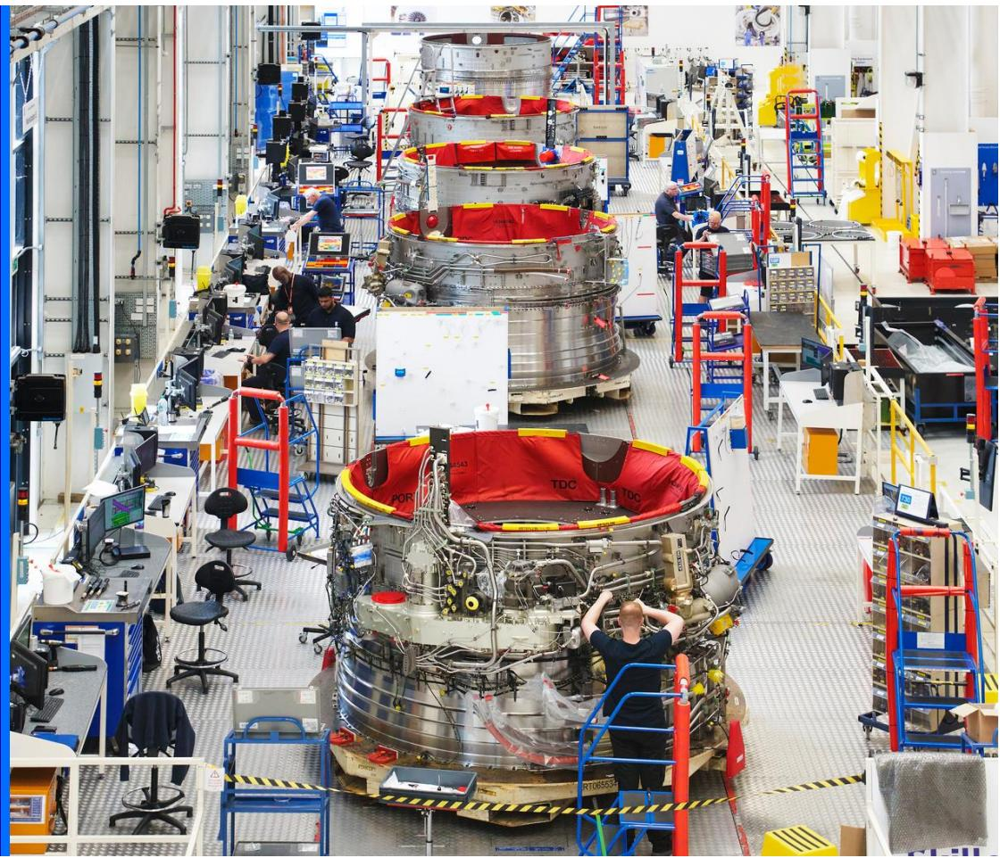
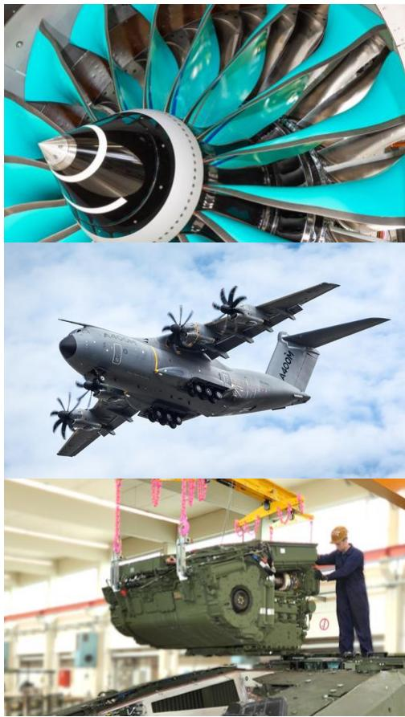
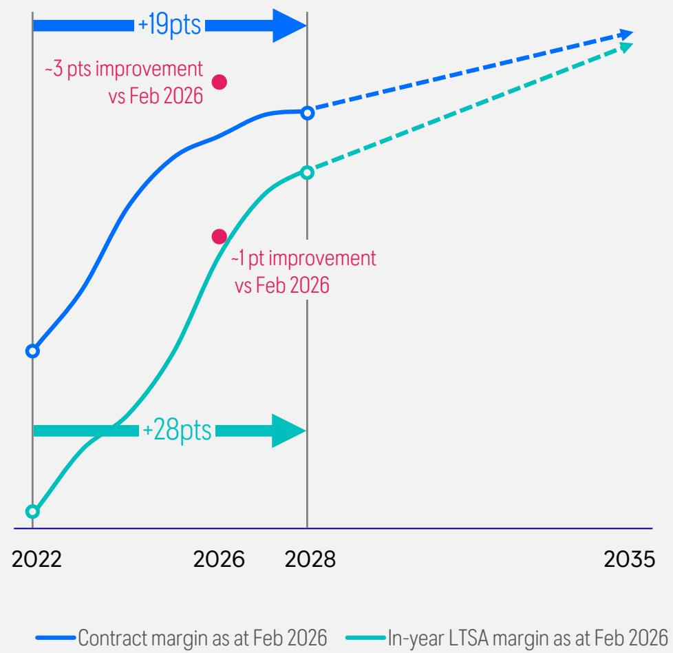
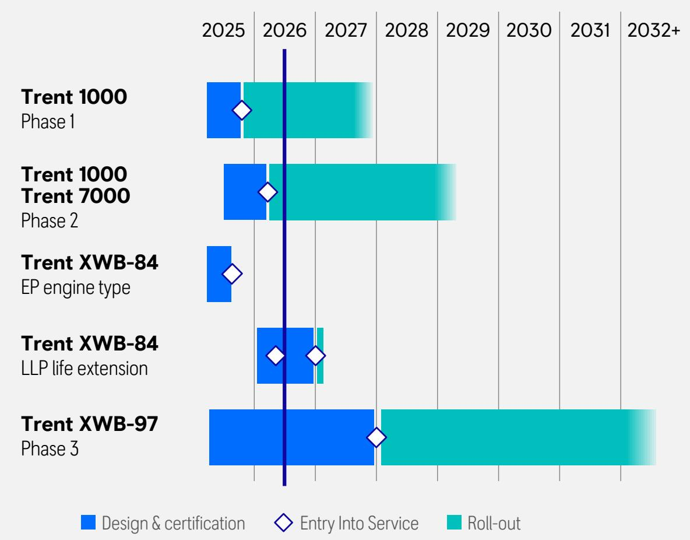
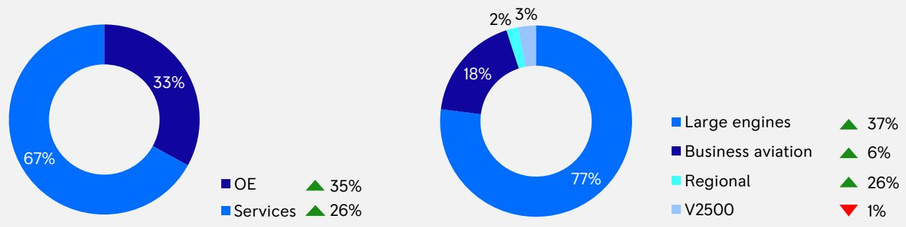
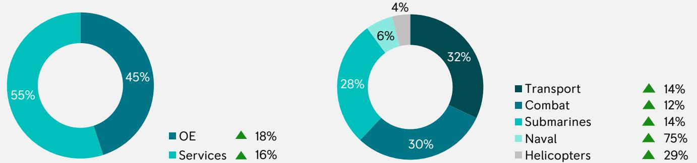
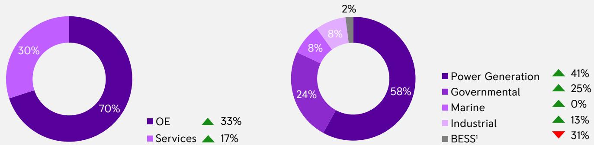
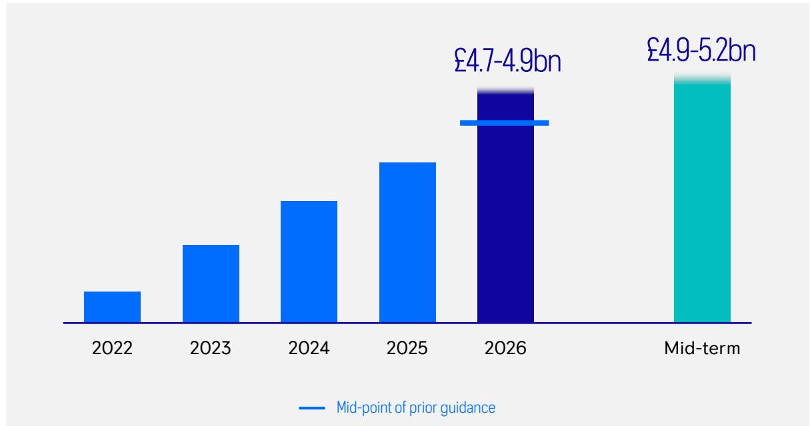
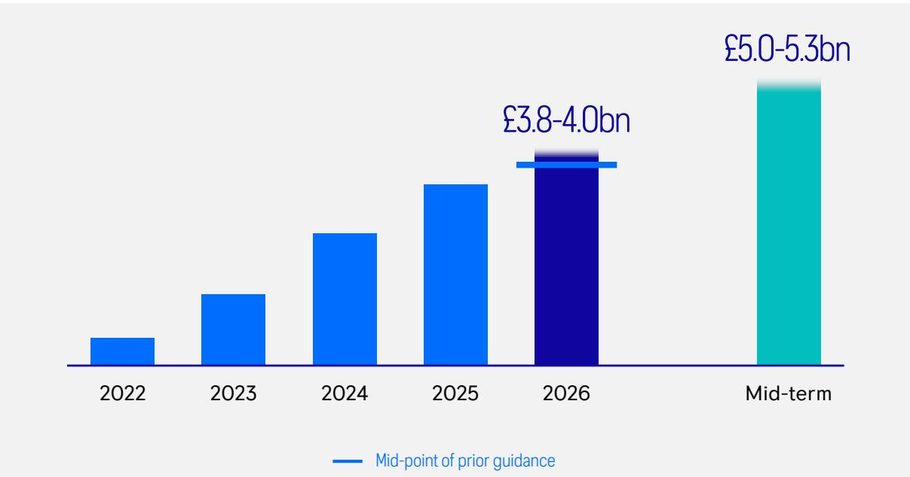
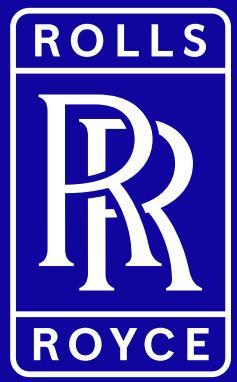

<!-- source page 1 -->

# HALF YEAR RESULTS 2026

ROLLS
RR
ROYCE

The information in this document is proprietary and confidential to Rolls-Royce and is available to authorised recipients only – copying and onward distribution is prohibited other than for the purpose for which it was made available.

<!-- source page 2 -->

# SAFE HARBOUR STATEMENT

This announcement contains certain forward-looking statements. These forward-looking statements can be identified by the fact that they do not relate only to historical or current facts. In particular, all statements that express forecasts, expectations and projections with respect to future matters, including trends in results of operations, margins, growth rates, overall market trends, the impact of interest or exchange rates, the availability of financing to the Company, anticipated cost savings or synergies and the completion of the Company's strategic transactions, are forward-looking statements. By their nature, these statements and forecasts involve risk and uncertainty because they relate to events and depend on circumstances that may or may not occur in the future. There are a number of factors that could cause actual results or developments to differ materially from those expressed or implied by these forward-looking statements and forecasts.

The forward-looking statements reflect the knowledge and information available at the date of preparation of this announcement and will not be updated during the year. Nothing in this announcement should be construed as a profit forecast. All figures are on an underlying basis unless otherwise stated - for the definition see note 2 to the condensed consolidated financial statements section of the 2026 Half Year Results Statement.

ROLLS
RR
ROYCE

© 2026 Rolls-Royce. Not Subject to Export Control

2

<!-- source page 3 -->

# 01

# TUFAN ERGINBILGIC

# Chief Executive Officer

ROLLS
RR
ROYCE

© 2026 Rolls-Royce. Not Subject to Export Control

<!-- source page 4 -->

# STRONG FIRST HALF DELIVERY; FY26 GUIDANCE RAISED

Transforming Rolls-Royce into a high performing, competitive, resilient, and growing business

- ■ Significant operational and strategic progress
- ■ Strong first half results driven by transformation and business improvements
- FY26 guidance raised
- ■ Further confidence in mid-term guidance
- 6.0p interim dividend announced
- - On track for £2.5bn share buyback in 2026
- ■ Resilient and diversified portfolio with significant growth potential

ROLLS
RR
ROYCE

© 2026 Rolls-Royce. Not Subject to Export Control

4

<!-- source page 5 -->

# STRONG OPERATIONAL AND FINANCIAL PERFORMANCE

# KEY GROUP FINANCIAL METRICS

Operating profit¹
£2.5bn

+46% yoy

Operating margin¹

22.5%

+3.1pts yoy

Free cash flow

£2.0bn

+24% yoy

Return on capital

22%

+5.1pts yoy

# DIVISIONAL OPERATING MARGIN¹

CIVIL AEROSPACE

25.3%

+0.5pts

DEFENCE

21.0%

+5.4pts

POWER SYSTEMS

20.3%

+5.3pts

ROLLS
ROYCE

$^{1}$ Operating profit and operating margin shown on an underlying basis

© 2026 Rolls-Royce. Not Subject to Export Control

5

<!-- source page 6 -->

# CONTINUED STRATEGIC PROGRESS

Contract and LTSA margin improvement across in-production engines

More than 100% improvement in time on wing of in-production engines with cash benefits significantly beyond the mid-term

ROLLS
RR
ROYCE

© 2026 Rolls-Royce. Not Subject to Export Control

6

<!-- source page 7 -->

# CONTINUED STRATEGIC PROGRESS

# 1. Portfolio choices & partnerships

- • Power Systems capacity expansion and next generation engine development on track
- - Beneficiary of the UK Defence Investment Plan and NATO summit commitments
- - Civil Aerospace - MRO $^{1}$ capacity expansion across the network
- - Project Sunrise A350-1000ULR test flight; Falcon 10X first flight

# 2. Strategic initiatives

- - Growing Civil LTSA margins $^{2}$
- - Continued progress towards Time on Wing target
- - Best-in-class AOG $^{3}$ benefitting us and our customers
- • Strong Trent 1000 XE commercial momentum
- - Defence - global leader in autonomous propulsion
- - Power Systems - capturing strong growth in power generation and governmental

# 3. Efficiency & simplification

- • Further improvement of TCC/GM ratio to 0.27x
- - Second phase of efficiency programme to support disciplined growth...
- - ...including GBS $^{4}$ scale-up and further SIOP $^{5}$ improvements
- - ...alongside further digital and lean manufacturing benefits

# 4. Lower carbon & digitally enabled businesses

- - Trent XWB-84 EP fuel efficiency above target
- - Rolls-Royce SMR - selected in Sweden; contracts signed in UK and Czech Republic
- - Digital thread across engineering, MRO, and the supply chain to drive further efficiencies and effectiveness

ROLLS
RR
ROYCE

$^{1}$ Maintenance, Repair, and Overhaul; $^{2}$ For in-production engines; $^{3}$ Aircraft on Ground; $^{4}$ Group Business Services; $^{5}$ Sales, Inventory, Operational Planning

© 2026 Rolls-Royce. Not Subject to Export Control

7

<!-- source page 8 -->

# 02

# HELEN McCABE

# Chief Financial Officer

ROLLS
RR
ROYCE

© 2026 Rolls-Royce. Not Subject to Export Control

<!-- source page 9 -->

# 2026 HALF YEAR UNDERLYING RESULTS

<table><tr><td>Underlying results£m</td><td>H1 2026</td><td>H1 2025</td><td>Organic Change1</td><td>Organic Change %1</td></tr><tr><td>Revenue</td><td>11,279</td><td>9,057</td><td>2,310</td><td>26%</td></tr><tr><td>Gross profit</td><td>3,397</td><td>2,572</td><td>839</td><td>33%</td></tr><tr><td>Gross margin %</td><td>30.1%</td><td>28.4%</td><td>1.6pts</td><td></td></tr><tr><td>Operating profit</td><td>2,534</td><td>1,733</td><td>796</td><td>46%</td></tr><tr><td>Operating margin %</td><td>22.5%</td><td>19.1%</td><td>3.1pts</td><td></td></tr></table>

<table><tr><td>pence</td><td>H1 2026</td><td>H1 2025</td><td>Change</td><td>Change %</td></tr><tr><td>Basic earnings per share</td><td>22.17</td><td>15.74</td><td>6.43</td><td>41%</td></tr><tr><td>Dividend per share</td><td>6.0</td><td>4.5</td><td>1.5</td><td>33%</td></tr></table>

<table><tr><td>£m</td><td>H1 2026</td><td>H1 2025</td><td>Change</td></tr><tr><td>Free cash flow</td><td>1,964</td><td>1,582</td><td>382</td></tr><tr><td>Net cash</td><td>2,136</td><td>1,084</td><td>1,052</td></tr><tr><td>Return on capital</td><td>22.0%</td><td>16.9%</td><td>5.1pts</td></tr></table>

Strong results - double-digit profit and cash growth across every division

Operating profit growth of £0.8bn and free cash flow growth of £0.4bn

Resilient balance sheet - net cash of £2.1bn
Interim dividend of 6.0p per share

Best-in-class return on capital
demonstrates significant value creation

ROLLS
RR
ROYCE

$^{1}$ Organic change is the measure of change at constant translational currency applying half year 2025 average rates to 2025 and 2026 and excludes M&A and business closures. All underlying income statement commentary is provided on an organic basis unless otherwise stated

© 2026 Rolls-Royce. Not Subject to Export Control

9

<!-- source page 10 -->

# CIVIL AEROSPACE

<table><tr><td>Underlying results£m</td><td>H1 2026</td><td>H1 2025</td><td>Organic Change</td><td>Organic Change %</td></tr><tr><td>Revenue</td><td>6,186</td><td>4,786</td><td>1,380</td><td>29%</td></tr><tr><td>Gross profit</td><td>1,857</td><td>1,477</td><td>378</td><td>26%</td></tr><tr><td>Gross margin %</td><td>30.0%</td><td>30.9%</td><td>(0.8)pts</td><td></td></tr><tr><td>Operating profit</td><td>1,567</td><td>1,193</td><td>374</td><td>31%</td></tr><tr><td>Operating margin %</td><td>25.3%</td><td>24.9%</td><td>0.5pts</td><td></td></tr><tr><td>Trading cash flow</td><td>1,458</td><td>1,111</td><td>347</td><td>31%</td></tr></table>

UNDERLYING REVENUE SPLITS

# KEY POINTS

- • 29% revenue growth, 31% profit growth
- - Higher large engine aftermarket profit across LTSA and time and materials
- - Higher net contractual margin improvements
- • Stronger business aviation performance

OE DELIVERIES

279 +18%

LARGE ENGINE OE DELIVERIES

157 +29%

LTSA ENGINE FLYING HOURS

10.0m +5%

TOTAL LTSA SHOP VISITS

712 +2%

ROLLS
ROYCE

© 2026 Rolls-Royce. Not Subject to Export Control

10

<!-- source page 11 -->

<table><tr><td>Underlying results£m</td><td>H1 2026</td><td>H1 2025</td><td>Organic Change</td><td>Organic Change %</td></tr><tr><td>Revenue</td><td>2,484</td><td>2,223</td><td>358</td><td>17%</td></tr><tr><td>Gross profit</td><td>639</td><td>462</td><td>192</td><td>42%</td></tr><tr><td>Gross margin %</td><td>25.7%</td><td>20.8%</td><td>4.6pts</td><td></td></tr><tr><td>Operating profit</td><td>522</td><td>342</td><td>192</td><td>57%</td></tr><tr><td>Operating margin %</td><td>21.0%</td><td>15.4%</td><td>5.4pts</td><td></td></tr><tr><td>Trading cash flow</td><td>615</td><td>327</td><td>288</td><td>88%</td></tr></table>

UNDERLYING REVENUE SPLITS

# KEY POINTS

- • 17% revenue growth, 57% profit growth
- - Higher aftermarket profit across transport and combat
- - Continued self-help benefits
- - Submarines growth

# ORDER INTAKE

# £2.4bn

# Book-to-bill ratio 1.0x

# ORDER BACKLOG

# £17.5bn

-7%

DEFENCE

ROLLS
RR
ROYCE

© 2026 Rolls-Royce. Not Subject to Export Control

11

<!-- source page 12 -->

# POWER SYSTEMS

<table><tr><td>Underlying results£m</td><td>H1 2026</td><td>H1 2025</td><td>Organic Change</td><td>Organic Change %</td></tr><tr><td>Revenue</td><td>2,604</td><td>2,042</td><td>573</td><td>28%</td></tr><tr><td>Gross profit</td><td>901</td><td>635</td><td>267</td><td>42%</td></tr><tr><td>Gross margin %</td><td>34.6%</td><td>31.1%</td><td>3.4pts</td><td></td></tr><tr><td>Operating profit</td><td>528</td><td>313</td><td>224</td><td>72%</td></tr><tr><td>Operating margin %</td><td>20.3%</td><td>15.3%</td><td>5.3pts</td><td></td></tr><tr><td>Trading cash flow</td><td>507</td><td>425</td><td>82</td><td>19%</td></tr></table>

UNDERLYING REVENUE SPLITS

■ Power Generation

■ Governmental

Marine

Industrial

BESS¹

▲ 41%

▲ 25%

▲ 0%

▲ 13%

31%

# KEY POINTS

- • 28% revenue growth, 72% profit growth
- - Strong power generation profit growth, driven by data centres
- • Higher governmental profit
- - Continued cost control

# ORDER INTAKE

# £4.6bn

# Book-to-bill ratio 1.8x

# ORDER BACKLOG

# £8.0bn

# +42%

ROLLS
ROYCE

$^{1}$ Battery Energy Storage Systems

© 2026 Rolls-Royce. Not Subject to Export Control

12

<!-- source page 13 -->

# SUMMARY FUNDS FLOW

<table><tr><td>£m</td><td>H1 2026</td><td>H1 2025</td><td>Change</td></tr><tr><td>Underlying operating profit</td><td>2,534</td><td>1,733</td><td>801</td></tr><tr><td>Net investments1</td><td>(73)</td><td>37</td><td>(110)</td></tr><tr><td>Movement in Civil LTSA balance, net of RRSAs2</td><td>86</td><td>472</td><td>(386)</td></tr><tr><td>Working capital, excluding Civil Net LTSA</td><td>65</td><td>(22)</td><td>87</td></tr><tr><td>Movement in provisions</td><td>(159)</td><td>(294)</td><td>135</td></tr><tr><td>Settlement of excess derivatives</td><td>(27)</td><td>(116)</td><td>89</td></tr><tr><td>Net interest</td><td>(7)</td><td>14</td><td>(21)</td></tr><tr><td>Tax</td><td>(525)</td><td>(259)</td><td>(266)</td></tr><tr><td>Other</td><td>70</td><td>17</td><td>53</td></tr><tr><td>Free cash flow</td><td>1,964</td><td>1,582</td><td>382</td></tr></table>

# KEY DRIVERS OF HIGHER YEAR ON YEAR FCF

- • Higher underlying operating profit
- - Higher net investments as we invest for future profitable growth
- - Lower net LTSA balance growth due to more shop visits and business improvements
- - Broadly similar working capital performance
- - Movement in provisions reflects renegotiations of onerous contracts
- - Higher cash tax costs

ROLLS
RR
ROYCE

$^{1}$ Net investments = D&A – capital element of lease payments – capital expenditure – investment $^{2}$ Risk and Revenue Sharing Arrangements

© 2026 Rolls-Royce. Not Subject to Export Control

13

<!-- source page 14 -->

# CAPITAL FRAMEWORK

Maintaining resilience, investing strategically, and rewarding shareholders

1 STRONG BALANCE SHEET

- • Net cash position of £2.1bn
- • £1.1bn of bonds repaid from cash
- • €1bn of bonds issued maturing in 2031 and 2036
- - Upgraded to A3 / A- rating by Moody’s / Fitch

2 REGULAR AND GROWING DIVIDENDS

- • Interim dividend of 6.0p
- • Target annual payout of 30%-40% of underlying profit after tax

3 FURTHER INVESTMENTS & SHAREHOLDER DISTRIBUTIONS

- • 2026 £2.5bn share buyback progressing: £1.4bn completed"
- • Disciplined investments: strategically aligned and value creative

ROLLS
R
ROYCE

$^{1}$ As of 29 July 2026

© 2026 Rolls-Royce. Not Subject to Export Control

14

<!-- source page 15 -->

# 03

# TUFAN ERGINBILGIC

# Chief Executive Officer

ROLLS
RR
ROYCE

© 2026 Rolls-Royce. Not Subject to Export Control

<!-- source page 16 -->

# FULL YEAR 2026 GUIDANCE RAISED

Strong delivery driven by transformation gives us confidence to raise our FY26 guidance

Operating profit¹

Free cash flow

Civil Aerospace drivers

<table><tr><td>Large engine EFH</td><td>Towards the lower end of the range of 115-120% of 2019</td></tr><tr><td>Total OE deliveries</td><td>550-600</td></tr><tr><td>Total shop visits</td><td>1,480-1,550</td></tr></table>

ROLLS
RR
ROYCE

$^{1}$ Underlying operating profit

© 2026 Rolls-Royce. Not Subject to Export Control

16

<!-- source page 17 -->

# ACHIEVING THE ROLLS-ROYCE PROPOSITION

# OUR TRANSFORMATION

- ■ Significant operational and strategic progress
- ■ Strong first half results driven by transformation and business improvements
- ■ FY26 guidance raised
- ■ Further confidence in mid-term guidance
- ■ 6.0p interim dividend announced
- - On track for £2.5bn share buyback in 2026
- ■ Resilient and diversified portfolio with significant growth potential

1. HIGH PERFORMING, COMPETITIVE, AND RESILIENT BUSINESS

2. GROWING SUSTAINABLE CASH FLOWS

3. STRONG BALANCE SHEET AND GROWING SHAREHOLDER RETURNS

ROLLS
ROYCE

© 2026 Rolls-Royce. Not Subject to Export Control

17

<!-- source page 18 -->

# Q&A

ROLLS
R
ROYCE

© 2026 Rolls-Royce. Not Subject to Export Control

Photo courtesy of Boeing

<!-- source page 19 -->

The information in this document is proprietary and confidential to Rolls-Royce and is available to authorized recipients only – copying and onward distribution is prohibited other than for the purpose for which it was made available.
