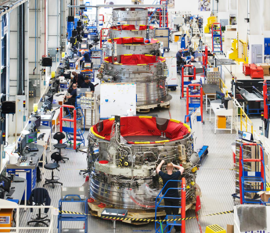
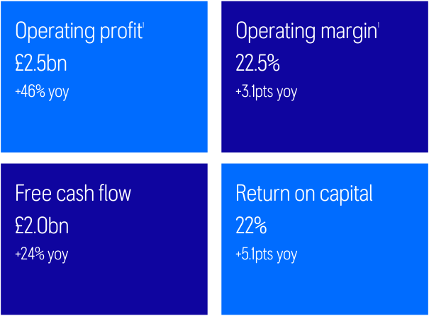
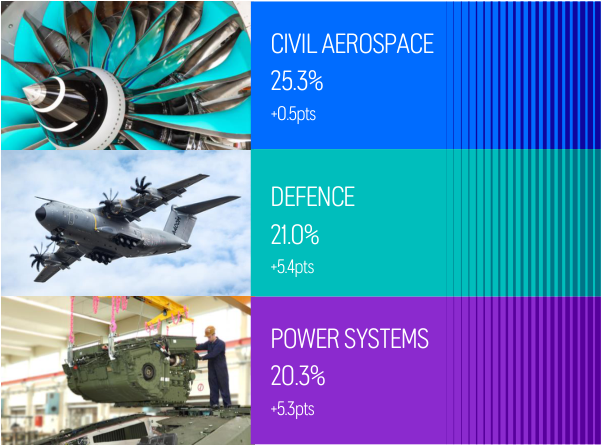
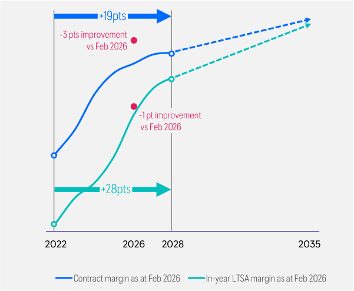
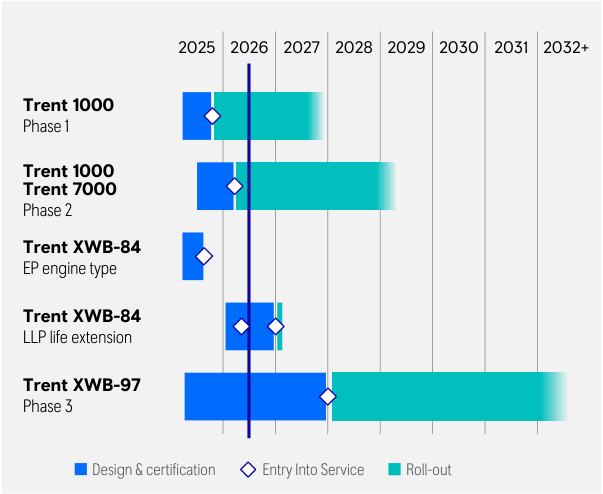
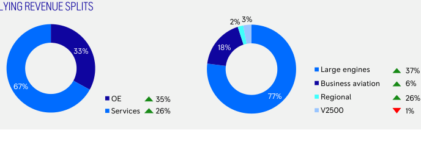
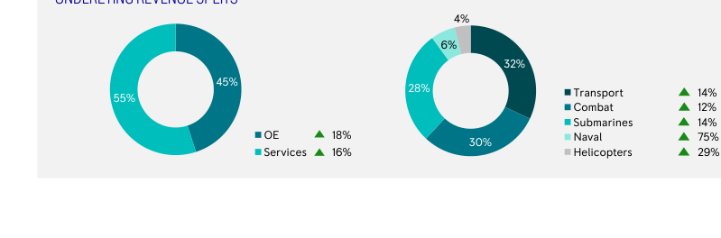
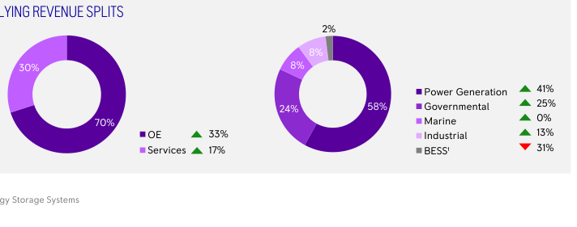
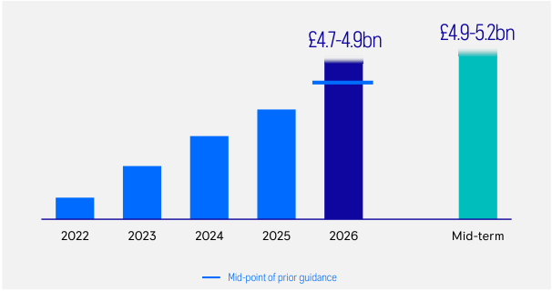
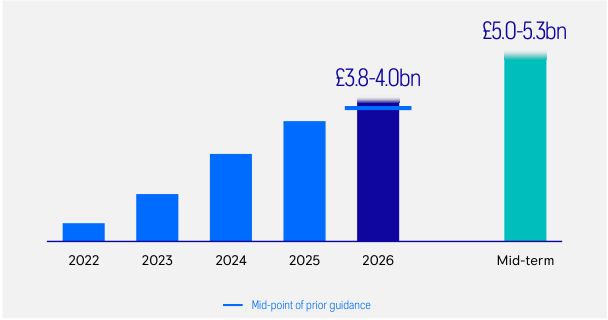

<!-- Start of picture text -->
; <!-- End of picture text -->

# HALF YEAR **RESULTS** 2026 

<!-- Start of picture text -->
ignrn enrm <!-- End of picture text -->

The information in this document is proprietary and confidential to Rolls-Royce and is available to authorised recipients only – copying and onward distribution is prohibited other than for the purpose for which it was made available. 

### SAFE HARBOUR STATEMENT 

This announcement contains certain forward-looking statements. These forward-looking statements can be identified by the fact that they do not relate only to historical or current facts. In particular, all statements that express forecasts, expectations and projections with respect to future matters, including trends in results of operations, margins, growth rates, overall market trends, the impact of interest or exchange rates, the availability of financing to the Company, anticipated cost savings or synergies and the completion of the Company’s strategic transactions, are forward-looking statements. By their nature, these statements and forecasts involve risk and uncertainty because they relate to events and depend on circumstances that may or may not occur in the future. There are a number of factors that could cause actual results or developments to differ materially from those expressed or implied by these forward-looking statements and forecasts. 

The forward-looking statements reflect the knowledge and information available at the date of preparation of this announcement and will not be updated during the year. Nothing in this announcement should be construed as a profit forecast. All figures are on an underlying basis unless otherwise stated - for the definition see note 2 to the condensed consolidated financial statements section of the 2026 Half Year Results Statement. 

2 

© 2026 Rolls-Royce. Not Subject to Export Control 

<!-- Start of picture text -->
[RO <!-- End of picture text -->

“i “&) ys | fs su? > ll 01 Chief Executive OfficerTUFAN ERGINBILGIC 

<!-- Start of picture text -->
uae SRS || <!-- End of picture text -->

© 2026 Rolls-Royce. Not Subject to Export Control 

### STRONG FIRST HALF DELIVERY; FY26 GUIDANCE RAISED 

Transforming Rolls-Royce into a high performing, competitive, resilient, and growing business 

- Significant operational and strategic progress 

- ▪ Strong first half results driven by transformation and business improvements 

- FY26 guidance raised 

- Further confidence in mid-term guidance 

- 6.0p interim dividend announced 

- On track for £2.5bn share buyback in 2026 

- ▪ Resilient and diversified portfolio with significant growth potential 

<!-- Start of picture text -->
Powe .jc ae eae Sees Hh Oe ie ee yy PY axq i= = + 4 = A 7 S & Btn 1S " | fi a > SS; nh ij ”* a Nits j ) » OI ( S > _- < 3 ) ae) a 9. | i af. Ce M i 1 z 7 s = y ~—l —ear e wy) ~ |e T 1 \ z i a aan ae ee ae oie a = 4 |i SS ie 7 jj <G wage Jere 7 he < eee ee aT) <!-- End of picture text -->

> © 2026 Rolls-Royce. Not Subject to Export Control 4 

### STRONG OPERATIONAL AND FINANCIAL PERFORMANCE 

<!-- Start of picture text -->
[ROLLS] <!-- End of picture text -->

###### KEY GROUP FINANCIAL METRICS 

DIVISIONAL OPERATING MARGIN 

<!-- Start of picture text -->
Operating profit1 Operating margin1 £2.5bn 22.5% +46% yoy +3.1pts yoy Free cash flow Return on capital £2.0bn 22% +24% yoy  +5.1pts yoy <!-- End of picture text -->

<!-- Start of picture text -->
CIVILAEROSPACE : - 25.3% +0.5pts <2“ : i y Vf Se DEFENCE 21.0% +5.4pts .. <a POWER SYSTEMS > ee eae | a al ry 20.3%+5.3pts <!-- End of picture text -->

5 

1 Operating profit and operating margin shown on an underlying basis 

© 2026 Rolls-Royce. Not Subject to Export Control 

### CONTINUED STRATEGIC PROGRESS 

Contract and LTSA margin improvement across in-production engines 

<!-- Start of picture text -->
+19pts ~3 pts improvement  vs Feb 2026 ~1 pt improvement  vs Feb 2026 +28pts 2022 2026 2028 2035 Contract margin as at Feb 2026 In-year LTSA margin as at Feb 2026 <!-- End of picture text -->

More than 100% improvement in time on wing of in-production engines with cash benefits significantly beyond the mid-term 

<!-- Start of picture text -->
2025 2026 2027 2028 2029 2030 2031 2032+ Trent 1000 Phase 1 Trent 1000 Trent 7000 Phase 2 Trent XWB-84 EP engine type Trent XWB-84 LLP life extension Trent XWB-97 Phase 3 Design & certification Entry Into Service Roll-out <!-- End of picture text -->

> © 2026 Rolls-Royce. Not Subject to Export Control 6 

### CONTINUED STRATEGIC PROGRESS 

1. Portfolio choices & partnerships 

2. Strategic initiatives 

##### 3. Efficiency & simplification 

2 

   - Growing Civil LTSA margins 

- Power Systems capacity expansion and next generation engine development on track 

   - Further improvement of TCC/GM ratio to 0.27x 

- Continued progress towards Time on Wing target 

      - Second phase of efficiency programme to support disciplined growth… 

   - Best-in-class AOG3 benefitting us and our customers 

- Beneficiary of the UK Defence Investment Plan and NATO summit commitments 

- Strong Trent 1000 XE commercial momentum 

   - …including GBS4 scale-up and further SIOP5 improvements 

- Civil Aerospace - MRO1 capacity expansion across the network 

   - Defence - global leader in autonomous propulsion 

   - …alongside further digital and 

   - • Power Systems - capturing lean manufacturing benefits 

   - strong growth in power generation and governmental 

- Project Sunrise A350-1000ULR test flight; Falcon 10X first flight 

4. Lower carbon & digitally enabled businesses 

- Trent XWB-84 EP fuel efficiency above target 

- Rolls-Royce SMR - selected in Sweden; contracts signed in UK and Czech Republic 

- Digital thread across engineering, MRO, and the supply chain to drive further efficiencies and effectiveness 

> © 2026 Rolls-Royce. Not Subject to Export Control 7 

1 Maintenance, Repair, and Overhaul; 2 For in-production engines; 3 Aircraft on Ground; 4 Group Business Services; 5 Sales, Inventory, Operational Planning 

02 Chief Financial OfficerHELEN McCABE 

© 2026 Rolls-Royce. Not Subject to Export Control 

### 2026 HALF YEAR UNDERLYING RESULTS 

<table><tr><th>Underlying results £m</th><th>H1 2026</th><th>H1 2025</th><th>Organic Change1</th><th>Organic Change %1</th></tr><tr><td>Revenue</td><td>11,279</td><td>9,057</td><td>2,310</td><td>26%</td></tr><tr><td>Gross profit</td><td>3,397</td><td>2,572</td><td>839</td><td>33%</td></tr><tr><td>Gross margin %</td><td>30.1%</td><td>28.4%</td><td>1.6pts</td><td></td></tr><tr><td>Operating profit</td><td>2,534</td><td>1,733</td><td>796</td><td>46%</td></tr><tr><td>Operating margin %</td><td>22.5%</td><td>19.1%</td><td>3.1pts</td><td></td></tr></table>

<table><tr><th>pence</th><th>H1 2026</th><th>H1 2025</th><th>Change</th><th>Change %</th></tr><tr><td>Basic earnings per share</td><td>22.17</td><td>15.74</td><td>6.43</td><td>41%</td></tr><tr><td>Dividend per share</td><td>6.0</td><td>4.5</td><td>1.5</td><td>33%</td></tr></table>

<table><tr><td>£m</td><td>H1 2026</td><td>H1 2025</td><td>Change</td></tr><tr><td>Free cash flow</td><td>1,964</td><td>1,582</td><td>382</td></tr><tr><td>Net cash</td><td>2,136</td><td>1,084</td><td>1,052</td></tr><tr><td>Return on capital</td><td>22.0%</td><td>16.9%</td><td>5.1pts</td></tr></table>

Strong results - double-digit profit and cash growth across every division 

Operating profit growth of £0.8bn and free cash flow growth of £0.4bn 

Resilient balance sheet - net cash of £2.1bn Interim dividend of 6.0p per share 

Best-in-class return on capital demonstrates significant value creation 

> 1 Organic change is the measure of change at constant translational currency applying half year 2025 average rates to 2025 and 2026 and excludes M&A and business closures. All underlying income statement commentary is provided on an organic basis unless otherwise stated 

9 

© 2026 Rolls-Royce. Not Subject to Export Control 

### CIVIL AEROSPACE 

<table><tr><th>Underlying results £m</th><th>H1 2026</th><th>H1 2025</th><th>Organic Change</th><th>Organic Change %</th></tr><tr><td>Revenue</td><td>6,186</td><td>4,786</td><td>1,380</td><td>29%</td></tr><tr><td>Gross profit</td><td>1,857</td><td>1,477</td><td>378</td><td>26%</td></tr><tr><td>Gross margin %</td><td>30.0%</td><td>30.9%</td><td>(0.8)pts</td><td></td></tr><tr><td>Operating profit</td><td>1,567</td><td>1,193</td><td>374</td><td>31%</td></tr><tr><td>Operating margin %</td><td>25.3%</td><td>24.9%</td><td>0.5pts</td><td></td></tr><tr><td>Trading cash flow</td><td>1,458</td><td>1,111</td><td>347</td><td>31%</td></tr></table>

<!-- Start of picture text -->
UNDERLYING REVENUE SPLITS 2%  3% 18% 33% Large engines 37% Business aviation 6% 67% OE 35% 77% Regional 26% Services 26% V2500 1% <!-- End of picture text -->

###### UNDERLYING REVENUE SPLITS 

###### KEY POINTS 

- 29% revenue growth, 31% profit growth 

- Higher large engine aftermarket profit across LTSA and time and materials 

- Higher net contractual margin improvements 

- Stronger business aviation performance 

OE DELIVERIES LARGE ENGINE OE DELIVERIES 279 +18% 157 +29% LTSA ENGINE FLYING HOURS TOTAL LTSA SHOP VISITS 10.0m +5% 712 +2% 

LTSA ENGINE FLYING HOURS 

> © 2026 Rolls-Royce. Not Subject to Export Control 10 

### DEFENCE 

<table><tr><th>Underlying results £m</th><th>H1 2026</th><th>H1 2025</th><th>Organic Change</th><th>Organic Change %</th></tr><tr><td>Revenue</td><td>2,484</td><td>2,223</td><td>358</td><td>17%</td></tr><tr><td>Gross profit</td><td>639</td><td>462</td><td>192</td><td>42%</td></tr><tr><td>Gross margin %</td><td>25.7%</td><td>20.8%</td><td>4.6pts</td><td></td></tr><tr><td>Operating profit</td><td>522</td><td>342</td><td>192</td><td>57%</td></tr><tr><td>Operating margin %</td><td>21.0%</td><td>15.4%</td><td>5.4pts</td><td></td></tr><tr><td>Trading cash flow</td><td>615</td><td>327</td><td>288</td><td>88%</td></tr></table>

###### UNDERLYING REVENUE SPLITS 

<!-- Start of picture text -->
4% 6% 32% 45% 28% 55% Transport 14% Combat 12% Submarines 14% OE 18% Naval 75% 30% Services 16% Helicopters 29% <!-- End of picture text -->

###### KEY POINTS 

- 17% revenue growth, 57% profit growth 

- Higher aftermarket profit across transport and combat 

- Continued self-help benefits 

- Submarines growth 

<!-- Start of picture text -->
ORDER BACKLOG <!-- End of picture text -->

###### ORDER INTAKE 

<!-- Start of picture text -->
£2.4bn Book-to-bill ratio 1.0x <!-- End of picture text -->

<!-- Start of picture text -->
£17.5bn <!-- End of picture text -->

<!-- Start of picture text -->
-7% <!-- End of picture text -->

> © 2026 Rolls-Royce. Not Subject to Export Control 11 

### POWER SYSTEMS 

<table><tr><th>Underlying results £m</th><th>H1 2026</th><th>H1 2025</th><th>Organic Change</th><th>Organic Change %</th></tr><tr><td>Revenue</td><td>2,604</td><td>2,042</td><td>573</td><td>28%</td></tr><tr><td>Gross profit</td><td>901</td><td>635</td><td>267</td><td>42%</td></tr><tr><td>Gross margin %</td><td>34.6%</td><td>31.1%</td><td>3.4pts</td><td></td></tr><tr><td>Operating profit</td><td>528</td><td>313</td><td>224</td><td>72%</td></tr><tr><td>Operating margin %</td><td>20.3%</td><td>15.3%</td><td>5.3pts</td><td></td></tr><tr><td>Trading cash flow</td><td>507</td><td>425</td><td>82</td><td>19%</td></tr></table>

<!-- Start of picture text -->
UNDERLYING REVENUE SPLITS 2% 8% 30% 8% Power Generation 41% 24% 58% Governmental 25% 0% 70% Marine OE 33% Industrial 13% Services 17% BESS¹ 31% Battery Energy Storage Systems <!-- End of picture text -->

###### UNDERLYING REVENUE SPLITS 

###### KEY POINTS 

- 28% revenue growth, 72% profit growth 

- Strong power generation profit growth, driven by data centres 

- Higher governmental profit 

- Continued cost control 

###### ORDER INTAKE 

###### ORDER BACKLOG 

£4.6bn 

£8.0bn 

Book-to-bill ratio 1.8x 

+42% 

1  Battery Energy Storage Systems 

> © 2026 Rolls-Royce. Not Subject to Export Control 12 

### SUMMARY FUNDS FLOW 

<table><tr><td>£m</td><td>H1 2026</td><td>H1 2025</td><td>Change</td></tr><tr><td>Underlying operating profit</td><td>2,534</td><td>1,733</td><td>801</td></tr><tr><td>Net investments1</td><td>(73)</td><td>37</td><td>(110)</td></tr><tr><td>Movement in Civil LTSA balance, net of RRSAs 2</td><td>86</td><td>472</td><td>(386)</td></tr><tr><td>Working capital, excluding Civil Net LTSA</td><td>65</td><td>(22)</td><td>87</td></tr><tr><td>Movement in provisions</td><td>(159)</td><td>(294)</td><td>135</td></tr><tr><td>Settlement of excess derivatives</td><td>(27)</td><td>(116)</td><td>89</td></tr><tr><td>Net interest</td><td>(7)</td><td>14</td><td>(21)</td></tr><tr><td>Tax</td><td>(525)</td><td>(259)</td><td>(266)</td></tr><tr><td>Other</td><td>70</td><td>17</td><td>53</td></tr><tr><td>Free cash flow</td><td>1,964</td><td>1,582</td><td>382</td></tr></table>

KEY DRIVERS OF HIGHER YEAR ON YEAR FCF 

- Higher underlying operating profit 

- Higher net investments as we invest for future profitable growth 

- Lower net LTSA balance growth due to more shop visits and business improvements 

- Broadly similar working capital performance 

- Movement in provisions reflects renegotiations of onerous contracts 

- Higher cash tax costs 

> © 2026 Rolls-Royce. Not Subject to Export Control 13 

1 Net investments = D&A – capital element of lease payments – capital expenditure – investment   2 Risk and Revenue Sharing Arrangements 

### CAPITAL FRAMEWORK 

Maintaining resilience, investing strategically, and rewarding shareholders 

   - Net cash position of £2.1bn 

- STRONG BALANCE SHEET 

- 1 

   - £1.1bn of bonds repaid from cash 

   - €1bn of bonds issued maturing in 2031 and 2036 

   - Upgraded to A3 / A- rating by Moody’s / Fitch 

- REGULAR AND GROWING DIVIDENDS 

- 2 

   - Interim dividend of 6.0p 

   - Target annual payout of 30%-40% of underlying profit after tax 

- FURTHER INVESTMENTS & 

- 3 SHAREHOLDER DISTRIBUTIONS 

- 1 

- • 2026 £2.5bn share buyback progressing: £1.4bn completed 

- Disciplined investments: strategically aligned and value creative 

1 As of 29 July 2026 

> © 2026 Rolls-Royce. Not Subject to Export Control 14 

03 Chief Executive OfficerTUFAN ERGINBILGIC 

© 2026 Rolls-Royce. Not Subject to Export Control 

### FULL YEAR 2026 GUIDANCE RAISED 

Strong delivery driven by transformation gives us confidence to raise our FY26 guidance 

Operating profit1 

###### Free cash flow 

<!-- Start of picture text -->
. £4.9-5.2bn £4.7-4.9bn 2022 2023 2024 2025 2026 Mid-term Mid-point of prior guidance <!-- End of picture text -->

<!-- Start of picture text -->
. £5.0-5.3bn £3.8-4.0bn 2022 2023 2024 2025 2026 Mid-term Mid-point of prior guidance <!-- End of picture text -->

###### Civil Aerospace drivers 

<table><tr><th>Large engine EFH</th><th>Towards the lower end of the range of 115-120% of 2019</th></tr><tr><td>Total OE deliveries</td><td>550-600</td></tr><tr><td>Total shop visits</td><td>1,480-1,550</td></tr></table>

16 

1 Underlying operating profit 

© 2026 Rolls-Royce. Not Subject to Export Control 

### ACHIEVING THE ROLLS-ROYCE PROPOSITION 

#### OUR TRANSFORMATION 

- Significant operational and strategic progress 

HIGH PERFORMING, COMPETITIVE, 1. AND RESILIENT BUSINESS 

- Strong first half results driven by transformation and business improvements 

- FY26 guidance raised 

- Further confidence in mid-term guidance 

   - GROWING SUSTAINABLE 

   - **2.** CASH FLOWS 

- 6.0p interim dividend announced 

- On track for £2.5bn share buyback in 2026 

- Resilient and diversified portfolio with significant growth potential 

3. 

- STRONG BALANCE SHEET AND GROWING SHAREHOLDER RETURNS 

> © 2026 Rolls-Royce. Not Subject to Export Control 17 

## Q&A 

© 2026 Rolls-Royce. Not Subject to Export Control 

Photo courtesy of Boeing 

The information in this document is proprietary and confidential to Rolls-Royce and is available to authorized recipients only – copying and onward distribution is prohibited other than for the purpose for which it was made available. 

© 2026 Rolls-Royce. Not Subject to Export Control 

